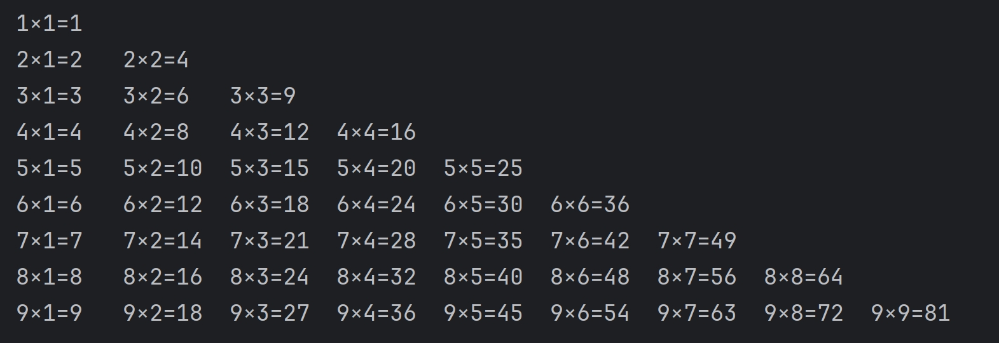
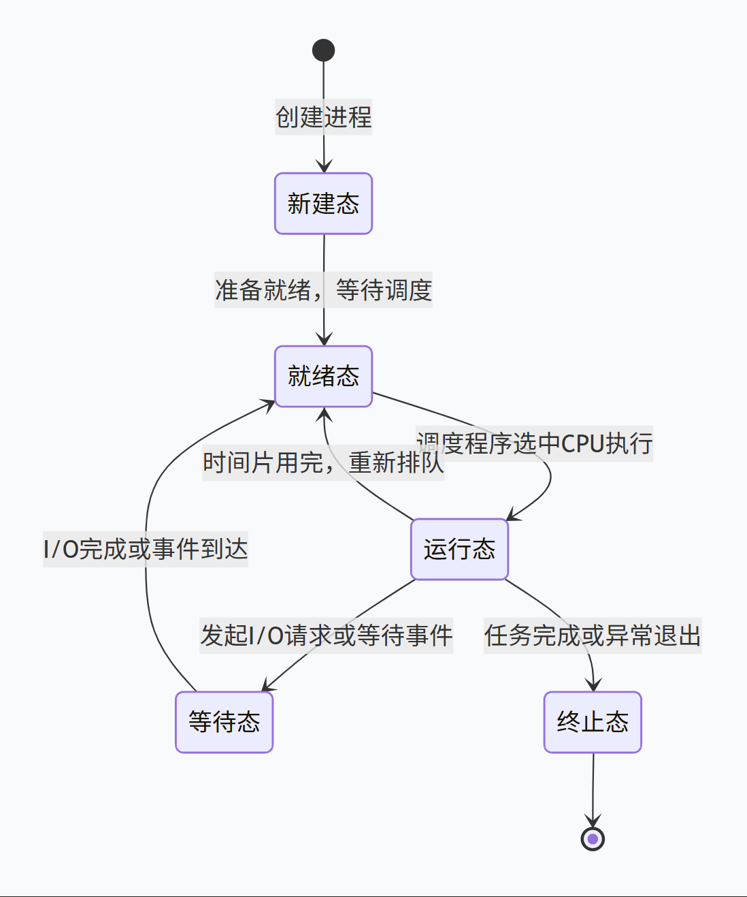
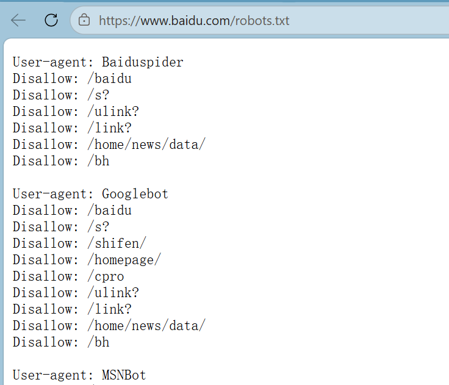
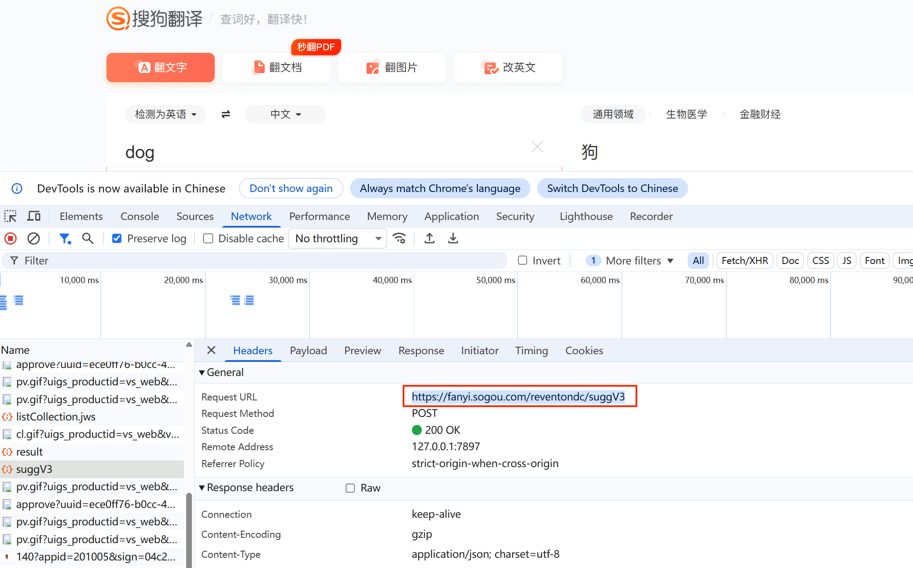
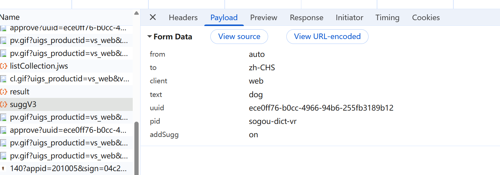
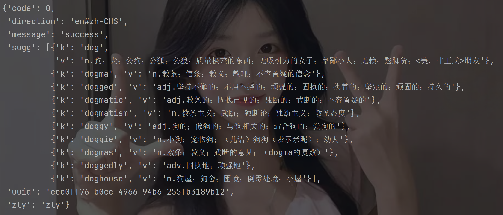
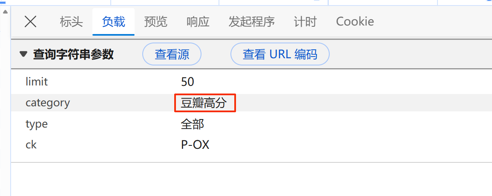
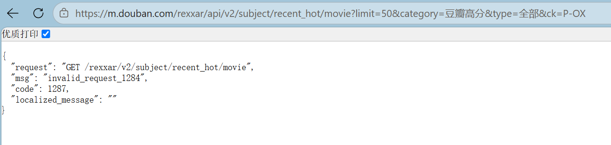
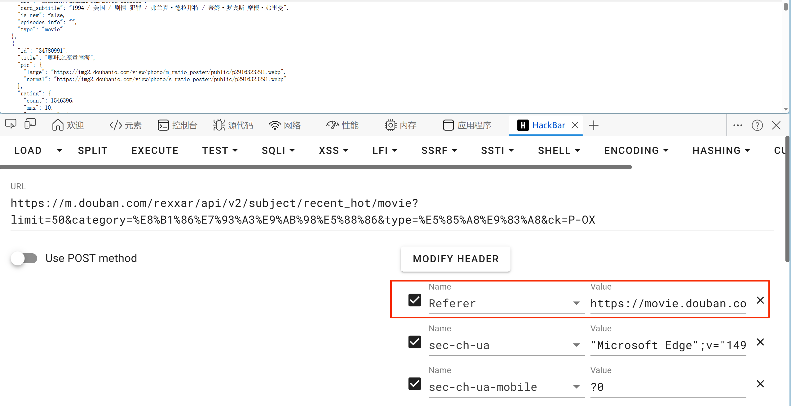
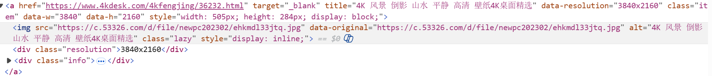

# Python基础

> **解释型语言**：Python 是一种解释型语言，代码运行时逐行解释执行。
>
> **动态类型**：变量在运行时决定类型，无需声明。

#### 编码

> 编码是将字符集转换为字节的方式。Python 3 默认使用 UTF-8 编码，能够支持多种语言的字符。

#### 缩进

>  在Python中，缩进用于表示代码块，这意味着代码的结构依赖于缩进而非符号
>
>  通常使用4个空格作为缩进


## 标识符

> **定义**：标识符用于命名变量、函数、类、模块等
>
> **规则**：
>
> - 只能使用字母（A-Z、a-z）、数字（0-9）和下划线（_）
> - 不能以数字开头
> - 区分大小写（例如，`myVar` 和 `myvar` 是不同的）
> - 不能使用Python保留字（如 `if`, `else`, `for`, `class` 等）


## 变量命名

- **规则**：遵循标识符的规则
- **命名规范**：

  - 使用有意义的名称，以便代码可读
  - 对于变量名使用小写字母，多个单词用下划线分隔（如 `total_sum`）
  - 类名通常使用驼峰命名法（如 `MyClass`）
  - 常量（不变的值）通常使用全大写字母（如 `MAX_SIZE`）


## 注释

#### 单行注释：使用 `#` 开头

```python
# 这是一个单行注释
```

#### 多行注释：使用三个引号（`'''` 或 `"""`）

```python
'''
这是一个多行注释
可以用于注释多行代码
'''
```


## 数据类型

> **基本数据类型**：
>
> 整数（int）  浮点数（float）  字符串（str）  布尔值（bool）
>
> 
>
> **复合数据类型**：
>
> 列表（list）   元组（tuple）   字典（dict）   集合（set）
>


#### 转换为整形：int()

```python
ling1=int('2')                  # 2

ling2=int(True)                # 1
ling3=int(False)               # 0

ling4=int(2.2)                 # 2 （浮点数向下取整）
ling6=int(2.6)                 # 2
```

#### 转换为浮点型：float()

```python
ling1=float('2')                # 2.0
ling2=float('2.5')              # 2.5
ling3=float(-2)                 # -2.0
ling4=float(True)               # 1.0
```

#### 转换为字符串：str()

```python
data1 = str(3)  # "3"
data2 = str(True)  # "True"
data3 = str(0.0)  # "0.0"
data4 = str(3.5)  # "3.5"
```

#### 转换为布尔值：bool()

```python
data1 = bool("3")       # True

data2 = bool(1)         # True （所有非0的数值为真）
data5 = bool(3.5)       # True
data3 = bool(0)         # False
data4 = bool(-1)        # True
data6 = bool(0.0)       # False
data7 = bool(None)      # False
```


#### 自动转换（隐式转换）

> int + float = float
>
> int + bool = int
>
> bool + bool = int

```python
print(1 + 2.5)            # 3.5
print(1 + True)           # 2
print(True + False)       # 1
```


## 运算符

### 算术运算符：

```python
加（+） 减（-） 乘（*） 除（/） 整除（//） 取余（%） 幂（**）
```

### 比较运算符：

```python
等于（==） 不等于（!=） 大于（>） 小于（<） 大于等于（>=） 小于等于（<=）
```

### 逻辑运算符：

```python
与（and） 或（or） 非（not）
```

### 成员运算符：

> 查看元素在不在其中
>
> `in`                如果在返回true，不在返回false
>
> `not in`         如果不在返回true，在返回false
>
> 字典看的是键


### 优先级（从高到低）

|    运算符类别    | 代表运算符                 |
| :--------------: | -------------------------- |
|       括号       | `()`                       |
|       指数       | `**`                       |
|    单目运算符    | `+x`, `-x`, `~x`           |
| 乘除、取余、整除 | `*`, `/`, `//`, `%`        |
|       加减       | `+`, `-`                   |
|       移位       | `<<`, `>>`                 |
|      位运算      | `&`, `^`, `                |
|       比较       | `in`, `is`, `<`, `>`, `==` |
|      布尔非      | `not`                      |
|      布尔与      | `and`                      |
|      布尔或      | `or`                       |
|    条件表达式    | `x if ... else ...`        |
|       赋值       | `=`, `+=`, `-=`, ...       |


# 控制结构

## 分支语句

```python
if condition:
    # 执行代码块
elif another_condition:
    # 执行其他代码块
elif 条件n:
    ···
else:
    # 执行备用代码块
```


## 循环语句

#### for 循环

```python
for item in range(1, 5):
    print(item)      # 1 2 3 4 5

for item in range(0, 10, 2):
    print(item)      # 0 2 4 6 8
```

#### 示例：

```python
for i in range(1,10):
    for n in range(1,i+1):
        print(f'{i}×{n}={i*n}\t',end='')         # \t 保持对齐
    print()
```



#### while 循环

```python
while condition:
    # 执行代码块
```


## break与continue

> break：跳出循环体，终止后续循环代码的执行
> continue：跳过本次循环，继续下次循环


## pass 语句

> 保持结构的完整性，不做任何作用，一般用作占位语句

```python
for Ling in range(10):
    if Ling == 2:
        pass
    else:
        print(Ling)
```


# 字符串

> 由字符的编码值组成的不可变序列容器，用于表示文本数据。在 Python 中，字符串可以使用单引号 `'`、双引号 `"` 或三引号 `'''`/`"""` 来定义
>
> 单双引号不能包裹其自身，但是可以互相包裹，三引号内可以包含单双引号

## 1.转义

> 以反斜杠`\`开头，改变字符的原始含义
>
> `\\`         `\'`          `\"`          `\n`换行符          `\t和\v`水平/垂直制表符


## 2.`f-string` 格式化字符串字面量

```python
name='黏黏'
chinese=9
math=100
print(f'期末考试{name}总成绩为：{chinese+math}分')
```


## 3.字符串的查找

#### 子字符串查找：关键字`in`

```python
ling='我喜欢凌'
if '凌' in ling:
    print('Found')               # Found
else:
    print('Not found')
```

#### 查找位置：`字符串.fund(要查找的字符)`或`字符串.index(要查找的字符)`

`fund`返回其找到的第一个字符的索引，如果没有找到返回`-1`

`rfund`返回其找到的最后一个字符索引

`index`找不到会引发 `ValueError`

#### 字符出现的次数：`字符串.count(要查找的字符)`


## 4.字符串的基本操作

#### 相加、重复

```python
a = '黏黏'
b = '糊糊'
print(a+b)                 # 黏黏糊糊
print(a*3)                 # 黏黏黏黏黏黏
```

#### 长度、索引、切片

> `len(元素)`获取长度
>
> 索引从0开始，支持负索引
>
> 切片 `字符串[起始:结束:步长]`

#### 大小写转换

> `字符串.upper()`         将字符串中所有字母转换为大写，并返回新的字符
>
> `字符串.lower()`         将字符串中所有字母转换为小写，并返回新的字符
>
> `字符串.capitalize()`         将字符串第一个字母转换为大写，其余转换为小写，并返回新的字符
>
> `字符串.title()`         将字符串每个单词首字母转换为大写，其余转换为小写，并返回新的字符

#### `字符串.strip([指定要去除的字符])`

> 移除字符串开头和结尾的指定字符（默认空格、制表符、换行等）
>
> 在处理文本数据时特别有用，可以去除不必要的空白
>
> `lstrip()`移除左侧字符，`rstrip()`移除右侧字符

```python
a = ' I Love ling '
clear = a.strip()
print(clear)          # I Love ling

a = 'xxI Love lingxx'
clear = a.lstrip('xx')
print(clear)          # I Love lingxx
clear = a.rstrip('xx')
print(clear)          # xxI Love ling
```

#### 字符串的分割、合并

> **分割：**
>
> `字符串.split('分割符')`：将字符串分割成子字符串列表
>
> 默认按照空白字符（空格、换行符\n、制表符\t等）来分割字符串，也可以指定一个字符串作为分割符
>
> `re.split(r'[多个分隔符]',字符串)`：多个分割符要用正则表达式，`\s`表示空白符
>
> 两个都可以指定分割次数：在后面前面加`,次数`
>
> 
>
> **合并：**
>
> `'连接符'.join(可迭代对象)`：将序列中的元素连接成一个新的字符串，只能连接字符串，故要先把元素都转为字符串型

```python
a= 'I Love ling'
print(a.split(' '))          # ['I', 'Love', 'ling']

import re
Ling = '她和文秀娟有一个很大的不同点，或者应该这么说，文秀娟和全班所有人都不同：别人都带着手套解剖，文秀娟不，她赤手！'
print(re.split(r'[，：]',Ling))
# ['她和文秀娟有一个很大的不同点', '或者应该这么说', '文秀娟和全班所有人都不同', '别人都带着手套解剖', '文秀娟不', '她赤手！']
```

```python
a = [2026,'04',17]
print('-'.join(map(str,a)))     # 2026-04-17      map()函数后面讲
```

#### 替换子字符串：`字符串.replace(old, new)`

```python
text = "Hello World"
print(text.replace("World", "Python"))  # 输出 'Hello Python'
```


## 5. 编码与解码

> **编码：`字符串.encode('编码方式')`**
>
> 将字符串转换为字节串（bytes）
>
> **解码：`字符串.decode('解码方式')`**
>
>  
>
> 获取字符串的Unicode码：`ord(字符串)`
>
> 获取Unicode码对应的字符串：`chr(Unicode码)`

```python
text='你好，阿凌'
print(text.encode('utf-8'))
# b'\xe4\xbd\xa0\xe5\xa5\xbd\xef\xbc\x8c\xe9\x98\xbf\xe5\x87\x8c'
```


## 6.常见检查方法

> 用于判断字符串是否符合特定格式或内容，返回的是布尔值
>
> `字符串.isalpha()`       是否全为字母
>
> `字符串.isdigit()`       是否全为数字
>
> `字符串.isalnum()`       是否全为数字和字母


## 7.综合练习

将字符串反转输出

```python
str1= 'You Can'
a = [item[::-1] for item in str1.split(" ")]
a = a[::-1]
print(" ".join(a))        # naC uoY
```


# 列表

## 一、创建列表

```python
empty_list = []                         # 空列表
numbers = [1, 2, 3, 4, 5]               # 包含整数的列表
mixed_list = [1, "hello", 3.14, True]   # 混合数据类型的列表

列表名 = list(可迭代对象)
number_list = list(range(1, 5))
```

## 二、列表的基本操作

### 访问元素

使用索引访问列表中的元素，索引从 0 开始，支持负索引

```python
numbers = [1, 2, 3, 4, 5]
print(numbers[0])    # 输出 1
print(numbers[-1])   # 输出 5（最后一个元素）

遍历：
Ling = [1,2,3,4,5]
for i in Ling:
    print(i)
    
反向遍历：
for i in range(len(ling)):
    print(ling[-1-i])
```

### 列表切片

使用切片获取列表中的一部分，格式为 `列表[起始:结束:步长]`。

```python
numbers = [1, 2, 3, 4, 5]
print(numbers[1:4])      # 输出 [2, 3, 4]
print(numbers[:3])       # 输出 [1, 2, 3]
print(numbers[::2])      # 输出 [1, 3, 5]
print(numbers[::-1])     # 输出 [5, 4, 3, 2, 1]（列表反转）
```

### 修改元素

使用索引修改列表中的元素

```python
numbers = [1, 2, 3, 4, 5]
numbers[0] = 10
print(numbers)       # 输出 [10, 2, 3, 4, 5]
```

### 添加元素

```python
# 列表名.append()在列表结尾添加元素
ling =[1,2,3,4,5,6]
ling.append(7)
print(ling)          # 输出 [1, 2, 3, 4, 5, 6, 7]
```

### 删除元素

```python
# 列表名.remove()删除列表中第一个匹配的元素
ling =[1,2,3,4,5,6,2]
ling.remove(2)
print(ling)          # 输出 [1, 3, 4, 5, 6, 2]

# del 列表名[索引或切片]
ling =[1,2,3,4,5,6]
del ling[0]
print(ling)          # 输出 [2, 3, 4, 5, 6]

ling =[1,2,3,4,5,6]
del ling[:3]
print(ling)          # 输出 [4, 5, 6]
```

### 插入元素

```python
# 列表名.insert(index, object) 
ling =[1,2,3,4,5,6]
ling.insert(2,2.5)
print(ling)           # 输出 [1, 2, 2.5, 3, 4, 5, 6]
```

### 扩展列表

```python
# 列表1.extend(列表2)将一个列表的所有元素添加到另一个列表末尾
numbers = [1, 2, 3]
more_numbers = [4, 5, 6]
numbers.extend(more_numbers)
print(numbers)        # 输出 [1, 2, 3, 4, 5, 6]
```

### 清空列表

```python
# 列表名.clear()删除列表中的所有元素
numbers = [1, 2, 3, 4]
numbers.clear()
print(numbers)        # 输出 []
```

### 查找元素的索引

```python
# 列表名.index(element)方法返回元素在列表中的第一个匹配的索引
numbers = [1, 2, 3, 4]
print(numbers.index(3))         # 输出 2
```

### 统计元素出现次数

```python
# 列表名.count(element)统计指定元素在列表中出现的次数
numbers = [1, 2, 2, 3, 4]
print(numbers.count(2))        # 输出 2
```

### 排序

`sort()` 方法对列表进行原地排序，改变原列表

`sorted()` 函数返回一个排序后的新列表，不改变原列表

默认升序，传入`reverse=True` 降序排序

```python
numbers = [3, 1, 4, 2]
numbers.sort()
print(numbers)                # 输出 [1, 2, 3, 4]

numbers = [3, 1, 4, 2]
sorted_numbers = sorted(numbers, reverse=True)
print(sorted_numbers)         # 输出 [4, 3, 2, 1]
```

### 反转列表

`列表名.reverse()`将列表中的元素顺序反转，改变原列表。

```python
numbers = [1, 2, 3, 4]
numbers.reverse()
print(numbers)               # 输出 [4, 3, 2, 1]
```


## 三、列表推导式

```python
[表达式 for 变量 in 可迭代对象 if 条件]
```

#### 示例

```python
numbers = [x**2 for x in range(1, 6)]
print(numbers)           # 输出 [1, 4, 9, 16, 25]

numbers = [x for x in range(10) if x % 2 == 0]
print(numbers)           # 输出 [0, 2, 4, 6, 8]
```


### 练习：列表的降维

```python
ling=[[1,2,3],[4,5,6]]
xgj=[]

for i in ling:
    for j in i:
        xgj.append(j)
print(xgj)                  # 输出 [1, 2, 3, 4, 5, 6]


a= [num for i in ling for num in i]
print(a)                    # 输出 [1, 2, 3, 4, 5, 6]
```


## 四、浅拷贝

> **外层独立，内层共享：**
>
> 浅拷贝会创建一个新的外层对象（如列表、字典），但内部嵌套的对象（如列表中的子列表、字典中的嵌套字典）仍然是原始引用
>
> 修改外层对象的“直接元素”不会影响原对象，但修改“嵌套对象”（如子列表的元素）会影响两者
>
> **与直接赋值的区别：**
>
> `a = b`是让两个变量指向同一个对象，修改其中一个会立即影响另一个
>
> 浅拷贝：`a = copy.copy(b)`（列表也可以用切片`[:]`）会创建一个新对象，但内部嵌套的对象仍与原对象共享

```python
ling1 = ['生吞', ['长夜难明', '十九年间谋杀小叙']]

ling2 = ling1
ling2[0] = '默读'
ling2[1][0] = '白夜行'
print(ling1)        # ['默读', ['白夜行', '十九年间谋杀小叙']]
print(ling2)        # ['默读', ['白夜行', '十九年间谋杀小叙']]
```

```python
ling1 = ['生吞', ['长夜难明', '十九年间谋杀小叙']]

ling2= list.copy(ling1)    # 或者ling1[:]
ling2[0] = '默读'
ling2[1][0] = '白夜行'
print(ling1)        # ['生吞', ['白夜行', '十九年间谋杀小叙']]
print(ling2)        # ['默读', ['白夜行', '十九年间谋杀小叙']]
```


## 五、其它常见函数

|  函数   | 描述                                     |
| :-----: | :--------------------------------------- |
| `len()` | 返回列表长度                             |
| `max()` | 返回列表的最大值元素                     |
| `min()` | 返回列表的最小值元素                     |
| `sum()` | 返回列表中所有元素的和（必须是数值类型） |


# 元组

>  元组是一种有序的、**不可变**的数据结构，可以存储多个元素。与列表类似，元组可以包含任意数据类型，但元组一旦创建，不能修改。元组使用小括号 `()` 表示，元素之间用逗号分隔。

## 一、创建元组

```python
ling1 = ()                    # 空元组
ling2 = (42,)        # 单个元素的元组，需在元素后加逗号

# 小括号可省略       避免使用
tuple = 1, "hello", 3.14
print(tuple)                  # 输出 (1, 'hello', 3.14)

tuple_type = tuple(可迭代对象)
```


## 二、元组的基本操作

> 虽然元组是不可变的，但我们可以通过索引和切片访问其中的元素，且与列表的方式一样

### 统计元素出现次数

```python
# count(element)
numbers = (1, 2, 2, 3, 4)
print(numbers.count(2))          # 输出 2
```

### 查找元素的索引

<span style='font-size:17.5px'>`元组名.index(element)`返回元素在列表中的第一个匹配的索引</span>

```python
numbers = (1, 2, 3, 4)
print(numbers.index(3))          # 输出 2
```

### 元组的不可变性

```python
numbers = (1, 2, 3)
# numbers[0] = 10                # 会引发 TypeError，因为元组不可变
```

```python
tuple1 = (1, 2)
tuple1 = (3, 4)
print(tuple)                 # (3, 4)
'''
tuple1 = (3, 4) 的意思是在另一个新的内存中创建了一个全新的元组对象，其内容是(3, 4)
然后，Python把tuple1这个“标签”从旧的(1, 2)对象上撕下来，贴到了新的(3, 4)对象上
而原来的(1, 2)元组对象因为不再有任何变量名指向它，就会被Python的垃圾回收机制在适当的时候回收掉，释放内存
'''
```


## 三、元组解包

> 将元组中的元素直接赋值给多个变量

#### 基础解包

变量的数量必须与元组中元素的数量相匹配，否则会引发 `ValueError`

```python
coordinates = (10, 20)

x, y = coordinates

print(x)              # 输出 10
print(y)              # 输出 20
```

#### *号解包

收集多余的值到一个**列表**中

```python
tuple1 = (1, 2, 3, 4, 5)

a, b, *c = tuple1
print(a,b,c)          # 1 2 [3, 4, 5]
a, *b, c = tuple1
print(a,b,c)          # 1 [2, 3, 4] 5
```


## 四、元组的使用场景

> 1. **多值返回**：函数返回多个值时，可以将它们放在一个元组中
> 2. **字典键**：元组可以作为字典的键（因为元组是不可变类型），而列表不行
> 3. **不需要修改的数据**：当数据不需要修改时，用元组可以避免数据被意外改变，提高代码的安全性和可读性
>


## 五、其它常见函数

|  函数   | 描述                                     |
| :-----: | :--------------------------------------- |
| `len()` | 返回列表长度                             |
| `max()` | 返回列表的最大值元素                     |
| `min()` | 返回列表的最小值元素                     |
| `sum()` | 返回列表中所有元素的和（必须是数值类型） |


# 集合

> 无序、不重复的元素集合，用花括号`{}`表示，空集合用`set()`
>
> **无序性：**元素没有索引，不能通过下标访问（`{1,2,3} == {3,2,1}`）
>
> **唯一性：**自动去重（`{1,1,2,2} ——> {1,2}`）
>
> **可变性：**集合本身可增删元素，但<span style='color:red'>元素必须是不可变类型</span>

## 一、从其它数据结构转换

```python
list_to_set = set([1, 2, 3])
tuple_to_set = set((1, 2, 3))
str_to_set = set("abc")
```

## 二、集合基本操作

### 添加元素

```python
s = {1, 2, 3}

s.add(4)           # 添加单个元素 → {1, 2, 3, 4}
s.update([5, 6])   # 添加多个元素 → {1, 2, 3, 4, 5, 6}
s.update({7, 8}, (9, 10))  # 可传入多个可迭代对象  {1, 2, 3, 7, 8, 9, 10}
```

### 删除元素

```python
s = {1, 2, 3, 4, 5}

s.remove(3)        # 删除指定元素，不存在则报错 KeyError
s.discard(10)      # 删除指定元素，不存在也不报错 ✅推荐
s.clear()          # 清空集合

del s              # 删除变量
```

### 并集

```python
a = {1, 2, 3, 4}
b = {3, 4, 5, 6}

print(a | b)           # {1, 2, 3, 4, 5, 6}
print(a.union(b))      # {1, 2, 3, 4, 5, 6}
```

### 交集

```python
a = {1, 2, 3, 4}
b = {3, 4, 5, 6}

print(a & b)           # {3, 4}
print(a.intersection(b))  # {3, 4}
```

### 差集

```python
a = {1, 2, 3, 4}
b = {3, 4, 5, 6}

print(a - b)           # {1, 2}（a中有但b中没有的）
print(b - a)           # {5, 6}（b中有但a中没有的）
print(a.difference(b)) # {1, 2}
```

### 集合关系判断

```python
a = {1, 2, 3}
b = {1, 2, 3, 4, 5}

print(a.issubset(b))         # True（a是b的子集）
print(a <= b)                # True（同上）

print(b.issuperset(a))       # True（b是a的超集）
print(b >= a)                # True

print(a.isdisjoint(b))       # False（有交集）
print(a.isdisjoint({7, 8}))  # True（无交集）
```


# 字典

> 字典是一种可变的、无序的（在 Python 3.7+ 版本中是有序的） 键值对集合，用于存储和查找数据。字典通过键（key）来访问值（value），**<span style='color:red'>键必须是唯一的且不可变的</span>**（通常为字符串或数字），而值可以是任意数据类型。字典使用大括号 `{}` 表示，键值对之间用`,`分隔，键和值之间用`:`分隔

## 一、访问值

```python
person = {'name': 'ling', 'age': 18}

# 1. 使用方括号 [] （如果键不存在会报错 KeyError）
print(person['name'])      # ling

# 2. 使用 .get() 方法（更安全，如果键不存在返回 None，可以设置默认值）
print(person.get('name'))  # ling
print(person.get('gender', '未设置'))  # 未设置
```

## 二、添加或修改元素

> 1.直接赋值即可，如果键已经存在，则就是修改值；如果键不存在，则就是添加新的键值对
>
> `字典['键'] = 值`
>
> 2.`字典.update({'键': 值, '': ,})`

## 三、删除元素

```python
person = {'name': 'ling', 'age': 18, 'city': '宁波'}

# 1. del语句（删除指定键值对，键不存在会报错)
del person['city']

# 2. .pop() 方法（删除并返回指定键的值，可以设置默认值避免报错)
delete = person.pop('sex', '没有这个键')

# 3. .popitem() 方法（删除并返回最后一个键值对)
last = person.popitem()

# 4. .clear() 方法（清空字典）
person.clear()
```

## 四、遍历

```python
# 遍历键
for i in person():
    print(i)

# 遍历值
for i in person.values():
    print(i)

# 遍历键值对
for key, value in person.items():
    print(f"{key}: {value}")
```


## 案例

#### 两数之和

> 给定一个整数数组 `nums` 和一个整数目标值 `target`，请你在该数组中找出 **和为目标值** *`target`* 的那 **两个** 整数，并返回它们的数组下标。
>
> 你可以假设每种输入只会对应一个答案，并且你不能使用两次相同的元素。
>
> 你可以按任意顺序返回答案。
>
>  
>
> **示例 1：**
>
> ```
> 输入：nums = [2,7,11,15], target = 9
> 输出：[0,1]
> 解释：因为 nums[0] + nums[1] == 9 ，返回 [0, 1] 。
> ```
>
> **示例 2：**
>
> ```
> 输入：nums = [3,3], target = 6
> 输出：[0,1]
> ```

```python
def twoSum(nums, target):
    num_map = {}
    for i, num in enumerate(nums):
        complement = target - num  # 计算需要的补数
        if complement in num_map:  # 如果补数已经在字典中
            return [num_map[complement], i]  # 返回补数的索引和当前索引
        num_map[num] = i  # 否则，将当前数字和索引存入字典
    return []
```


# 函数

## 一、语法

```python
def function_name(形参):
    """可选的文档字符串"""
    # 函数体
    return result  # 可选的返回值

# 调用
function_name(实参)

# return 后面的代码不执行
```


## 二、参数

### 1. 位置参数

> 按参数定义的顺序传值

### 2. 关键字参数

> 通过`参数名=值`的形式传递，不依赖顺序

### 3. 默认参数

> 为参数指定默认值，调用时可以选择性传入参数

```python
def power(x, n=2):
    return x ** n

print(power(3))        # 输出: 9 (使用默认 n)
print(power(3, 3))     # 输出: 27 (覆盖默认 n)
```

### 4. 可变位置参数

> `*args` 用于传入任意数量的位置参数
>
> `**kwargs` 用于传入任意数量的关键字参数，以字典形式存储

```python
def sum_all(*args):
    return sum(args)

print(sum_all(1, 2, 3, 4))  # 输出: 10

def print_info(**kwargs):
    for key, value in kwargs.items():
        print(f"{key}: {value}")

print_info(name="Alice", age=30)  # 输出: name: Alice, age: 30
```

### 5. 参数解包

> **位置参数解包：**用`*`将列表/元组解包为位置参数
>
> **关键字参数解包：**用`**`将字典解包为关键字参数

```python
def c_all(a, b, c):
    return a * b * c

n = [1, 2, 3]
print(c_all(*n))

kwargs = {"name": "Bob", "age": 30}
print_info(**kwargs)
```

### 6. 参数顺序规则

```python
def func(a, b=0, *args, c, d=1, **kwargs):
    pass
```


## 三、函数的返回值

> `return` 语句指定返回值。如果没有 `return`，函数将返回 `None`
>
> **返回多个值：**使用逗号隔开，返回的是元组了（后续进行解包赋值）


## 四、匿名函数（`lambda`表达式）

> ```python
> 变量 = lambda 参数列表: 表达式
> ```
>
> 参数列表：逗号分割参数
>
> 表达式：只有一行，自动返回结果

### 使用场景：

```python
# 简单运算
square = lambda x: x ** 2
print(square(5))           # 25

# 无参数
greet = lambda: "Hello!"
print(greet())             # Hello!
```


## 五、作用域（Scope）

> Python的作用域遵循 **LEGB规则**，即变量的查找顺序为：**Local（局部）→ Enclosing（嵌套）→ Global（全局）→ Built-in（内置）**

### 1. LEGB作用域层次

> #### Local（局部作用域）
>
> 在函数或代码块内部定义的变量，函数执行时创建，函数结束时销毁
>
> #### Enclosing（嵌套作用域）
>
> 在嵌套函数中，内层函数可以访问外层函数的变量
>
> #### Global（全局作用域）
>
> 在模块（文件）顶层定义的变量或函数，模块加载时创建，程序结束时销毁
>
> #### Built-in（内置作用域）
>
> Python内置的名称，Python解释器启动时创建，关闭时销毁

### 2. 变量的修改与关键字

> **修改全局变量：`global`**
>
> ```python
> count = 0
> def increment():
>        global count  # 声明count为全局变量
>        count += 1
> ```
>
> **修改嵌套作用域变量：`nonlocal`**
>
> ```python
> def outer():
>        x = 10
>        def inner():
>            nonlocal x  # 声明x为外层变量
>            x += 5
>        inner()
>        print(x)  # 15
> ```
> 


## 六、闭包

> 闭包通常出现在嵌套函数中：当一个内层函数引用了其外层函数的变量，并且外层函数返回了这个内层函数，就形成了闭包
>
> ```python
> def 奶茶店(糖度):
>        def 取餐(号码):
>            return f"{糖度}糖的奶茶"  # 自动记住糖度！
>        return 取餐
> 
> 我的专属 = 奶茶店("少糖")  # 说一次就够了
> 
> print(我的专属("#10"))  # 少糖 ✅
> print(我的专属("#11"))  # 还是少糖 ✅
> ```

```python
def outer(x):
    def inner(y):
        return x + y    # 引用了外部变量 x
    return inner  # 返回内部函数

closure = outer(10)
print(closure(5))     # 输出: 15
```


### 闭包中修改外层变量：`nonlocal`

```python
def counter():
    count = 0
    def increment():
        nonlocal count
        count += 1
        return count
    return increment

c = counter()
print(c())  # 1
print(c())  # 2
```


### 装饰器

> 在不改变原函数代码的情况下，给函数添加新功能
>
> ```python
> # 比如有个函数会打招呼：
> def say_hello():
>    	 print("你好！")
> 
> # 每次打招呼前（或者后），都说“我叫尹文轩”
> def new_say_hello(func):
>        def new():
>            print("我叫尹文轩")   # 外加的功能
>            func()              # 调用原来的函数
>        return new
> 
> # 使用：把原函数"包"一下
> say_hello = new_say_hello(say_hello)
> say_hello()
> ```
>
> 再用 `@` 语法糖（简化写法）
>
> ```python
> def new_say_hello(func):
>        def new():
>            print("我叫尹文轩")
>            func()
>        return new
> 
> @new_say_hello
> def say_hello():
>        print("你好！")
> 
> 
> say_hello()
> ```

#### 带参

```python
def timer(func):
    def inner(*args, **kwargs):
        import time
        start = time.perf_counter()
        result = func(*args, **kwargs)
        end = time.perf_counter()
        print(f"函数 {func.__name__} 运行了 {(end-start)* 1000:.6f} 秒")
        return result
    return inner

@timer
def add(a, b):
    return a + b

print(add(3, 5))
```


# 算法

## 冒泡排序

> 重复地遍历要排序的列表，比较相邻的元素，就像气泡一样，**最大（或最小）的元素会"冒泡"到数组的一端**

```python
def bubble_sort(arr):
    n = len(arr)
    # 外层循环：控制排序轮数
    for i in range(n):
        # 内层循环：比较相邻元素
        for j in range(0, n - i - 1):
            if arr[j] > arr[j + 1]:
                arr[j], arr[j + 1] = arr[j + 1], arr[j]  # 交换
    return arr

# 测试
arr = [64, 34, 25, 12, 22, 11, 90]
print("排序前:", arr)
print("排序后:", bubble_sort(arr))

```

优化版本：

```python
def bubble_sort_optimized(arr):
    n = len(arr)
    for i in range(n):
        swapped = False  # 标记本轮是否发生交换
        for j in range(0, n - i - 1):
            if arr[j] > arr[j + 1]:
                arr[j], arr[j + 1] = arr[j + 1], arr[j]
                swapped = True
        
        # 如果本轮没有交换，说明已排序完成
        if not swapped:
            break
    return arr

arr = [5, 1, 4, 2, 8]
print(bubble_sort_optimized(arr))  # [1, 2, 4, 5, 8]

```


# 面向对象（OOP）

> **<span style='font-size:18px'>类（Class）- 图纸/模具</span>**
>
> 类是一个末班或蓝图，它定义了一类事物共有的属性和方法。它本身不占用内存，只是概念上的定义
>
> + “汽车设计图”就是一个类。它规定了汽车应该有4个轮子、1个方向盘、加速、刹车，但它本身不是一辆能开的车。
>
> 使用 `class` 关键字定义一个类，类名通常首字母大写（驼峰命名法）
>
> 
>
> **<span style='font-size:18px'>对象（Object） - 产品</span>**
>
> 对象是根据类这个蓝图创建出来的**具体实例**。每个对象都有自己的独立属性值，但共享相同的方法
>
> - 根据“汽车设计图”制造出来的一辆红色的特斯拉Model 3、一辆黑色的比亚迪汉，这些就是**对象**。它们都是“汽车”**类的实例**。
>
> 
>
> **<span style='font-size:18px'>`__init__` 方法（构造函数）：</span>**
>
> 这是“初始化方法”，在创建对象时自动调用，给新创建的对象设置初始状态（属性）
>
> ```python
> def __init__(self, 参数1, 参数2):
>     self.属性1 = 参数1
>     self.属性2 = 参数2
> ```
>
> 
>
> **<span style='font-size:18px'>类属性：</span>**
>
> 所有实例共享同一个类属性的值，直接在类中通过`变量 = 值`的形式定义，<span style='color:red'>调用：`类名.属性名`</span>
>
> 
>
> **<span style='font-size:18px'>实例方法：</span>**
>
> 是作用于对象的方法，第一个参数为 `self`，表示该方法属于对象，可以访问对象的属性

```python
class Car:
    # 类属性
    wheels = 4

    def __init__(self, color, brand):
        # “实例属性”，每个对象都有自己独立的一份
        # self.指向当前正在创建的对象
        self.color = color
        self.brand = brand
        self.speed = 0      # 初始速度都为0

    # 这是“实例方法”，对象能执行的操作
    def accelerate(self, increment):
        self.speed += increment
        print(f"{self.brand}加速了！当前速度：{self.speed} km/h")

    def brake(self):
        self.speed = 0
        print(f"{self.brand}刹车了！已停止。")

    def show_info(self):
        print(f"这是一辆{self.color}色的{self.brand}")


# 创建对象
my_car = Car('紫色', '法拉利')
you_car = Car('蓝色', '李法拉')

# 调用对象的方法
my_car.accelerate(100)

# 他们共享属性
print(Car.wheels)       # 4
print(my_car.wheels)    # 4
print(you_car.wheels)   # 4
```

**<span style='font-size:21px'>银行案例</span>**

```
D:\py-project\案例\OOP银行存取钱.py
```


## 跨类调用


## 类中的方法

### 1. 静态方法（@staticmethod）

> 放在类里的普通函数，可以没有参数，使用 `@staticmethod`装饰器定义

```python
class Friends:
    name = 'ling'

    @staticmethod   # 定义静态方法
    def static_method():
        print(f'2024.2.1，我和{Friends.name}成为最好的朋友')

# 调用静态方法
Friends.static_method()            # 2024.2.1，我和ling成为最好的朋友
```


## 面向对象三大特性

### 1. 封装

> 将数据和操作数据的代码绑定在一起，隐藏内部实现细节，只暴露必要的接口
>
> 
>
> **封装的好处：**
>
> 安全性：防止外部直接修改数据
>
> 易维护：内部实现可以改变，外部调用不变
>
> 简化使用：只暴露必要的接口

#### 命名约定

> 双下划线：`__`私有，外部不可用
>
> 单下划线：`_`受保护，子类可用

```python
class Movie:
    def __init__(self, name, type):
        self.name = name
        self.__type = type   # 私有属性

    def __say(self):         # 私有方法
        print(f'电影‘{self.name}’的类型是{self.__type}')
        
    def getType(self):
        return self.__type
    
    def setType(self, val):
        self.__type = val

m1 = Movie('新世界', '韩版无间道')
# 强制访问
m1._Movie__say()
print(m1._Movie__type)
```

#### @property @name.setter

> `@property`把方法变成<span style='color:red'>只读属性</span>来访问
>
> `@name.setter`用于<span style='color:red'>给属性赋值时</span>添加逻辑，本质上是把一个方法变成"可写的属性"，名称必须和 `@property` 的名称一致

```python
class Movie:
    def __init__(self, name, type):
        self.name = name
        self.__type = type   # 私有属性

    @property
    def type(self):         # 私有方法
        return self.__type
    @type.setter
    def type(self, val):
        self.__type = val

m1 = Movie('新世界', '韩版无间道')
print(m1.type)        # 韩版无间道
m1.type = '黑帮'
print(m1.type)        # 黑帮
```


### 2. 继承

> 子类可以获得父类的属性和方法，并且可以直接使用/修改/扩展/添加父类的功能

```python
# 父类（基类）
class Animal:
    def __init__(self, name):
        self.name = name

    def speak(self):
        print(f"{self.name}发出声音")


# 子类（派生类）
class Dog(Animal):  # 括号里写父类名
    def fetch(self):
        print(f"{self.name}去捡球")


dog = Dog("旺财")
dog.speak()  # 继承自父类 → 旺财发出声音
dog.fetch()
print(dog.name)  # 继承自父类 → 旺财
```

#### 子类初始化

> 当子类有构造函数的时候使用自己的，不用父类的
>
> 如果既要用子类自己的也要用父类的，需要用`super()`“调用父类方法”

```python
class Person:
    def __init__(self, name, age):
        self.name = name
        self.age = age

class Student(Person):
    def __init__(self, name, age, student_id):
        super().__init__(name, age)  # 调用父类的__init__
        self.student_id = student_id  # 再加自己的属性

# 使用
s = Student("张三",18, 20260511)
print(s.name, s.age, s.student_id)
```


### 3. 多态

> 不同的对象调用不同的方法会有不同的行为

#### 继承 + 方法重写

```python
class Animal:
    def __init__(self, name):
        self.name = name

    def speak(self):
        pass

class Dog(Animal):
    def speak(self):
        print("汪汪汪")

class Cat(Animal):
    def speak(self):
        print("喵喵喵")

class Bird(Animal):
    def __init__(self, name, can_fly):
        super().__init__(name)
        self.can_fly = can_fly

    def speak(self):
        print("叽叽喳喳")
        

dog = Dog("旺财")
dog.speak()

cat = Cat("咪咪")
cat.speak()

bird = Bird("小鸟", True)
bird.speak()
print(f"{bird.name}是否会飞: {bird.can_fly}")
```


# 异常处理

## 常见内置异常

|          异常           | 说明         | 示例            |
| :---------------------: | ------------ | --------------- |
|    **`ValueError`**     | 值错误       | `int('abc')`    |
|     **`TypeError`**     | 类型错误     | `'1' + 1`       |
|    **`IndexError`**     | 索引越界     | `list[100]`     |
|     **`KeyError`**      | 字典键不存在 | `dict['key']`   |
| **`FileNotFoundError`** | 文件不存在   | `open('x.txt')` |
| **`ZeroDivisionError`** | 除以零       | `10 / 0`        |
|  **`AttributeError`**   | 属性不存在   | `obj.method()`  |
|    **`ImportError`**    | 导入失败     | `import xyz`    |


## 语法

```python
try:
    # 尝试执行的代码
    risky_code()
    
except ValueError as e:
    # 捕获特定异常
    print(f"值错误: {e}")
    
except (TypeError, KeyError) as e:
    # 捕获多种异常
    print(f"类型或键错误: {e}")
    
except Exception as e:
    # 捕获所有异常（不推荐，太宽泛）
    print(f"未知错误: {e}")
    
else:
    # ✅ 没有异常时执行
    print("执行成功！")
    
finally:
    # 🔄 无论是否有异常都会执行
    print("清理资源...")
```


## `raise` 主动抛出异常

```python
def set_age(age):
    if age < 0:
        raise ValueError("年龄不能为负数")
    if age > 150:
        raise ValueError("年龄不合理")
    return age

try:
    set_age(-5)
except ValueError as e:
    print(e)  # 年龄不能为负数
```


## 自定义异常

> 通常继承`Exception`或其子类
>
> `super().__init__(f"传给父类的错误信息")` 报错时输出的错误信息

```python
class MyError(Exception):
    """基础自定义异常"""
    pass

# 使用
try:
    pass
except MyError as e:
    print(f"捕获到错误: {e}")
```


## 案例

### 银行账户系统

| 要求                 | 说明                                                         |
| -------------------- | ------------------------------------------------------------ |
| 🔒 封装               | `balance` 私有 `_balance`                                    |
| 📦 `deposit(amount)`  | 存钱，金额必须 > 0，否则抛 `InvalidAmountError`              |
| 💸 `withdraw(amount)` | 取钱，金额必须 > 0，否则抛 `InvalidAmountError`；余额不足抛 `InsufficientBalanceError` |
| 👁️ `get_balance()`    | 查看余额（只读）                                             |

### 异常体系

```
BankError
 ├── InvalidAmountError
 ├── InsufficientBalanceError
 └── NegativeBalanceError
```

### 代码

```
D:\py-project\案例\OOP银行存取钱.py
```


# 迭代器

> 迭代器（Iterator） 是一个可以记住遍历位置的对象，它实现了**迭代器协议**：
>
> **魔术方法：**
>
> `__iter__()`  返回迭代器对象本身
>
> `__next__()`  返回下一个值，没有元素时抛出 `StopIteration` 异常
>
> **内置函数：**
>
> `iter()`
>
> `next()`
>
> 
>
> 迭代器最大的优势是**按需生成值**，而不是一开始就把所有值加载到内存，这在处理大文件或无限序列时尤为关键

```python
for item in [1, 2, 3]:
    print(item)

# 实际上等价于：
it = iter([1, 2, 3])
while True:
    try:
        item = next(it)
        print(item)
    except StopIteration:
        break
```

## 自定义迭代器

```python
class MyRange:
    def __init__(self, start, end):
        self.current = start
        self.end = end

    def __iter__(self):    # for 循环要求对象必须能通过 iter() 变成迭代器
        return self

    def __next__(self):
        if self.current < self.end:
            num = self.current         # 如果没有 num 则输出1 2 3 4 5
            self.current += 1
            return num
        raise StopIteration


# 使用
for i in MyRange(0, 5):
    print(i)  # 0 1 2 3 4
```


## 生成器：最便捷的迭代器

> 生成器是一种特殊的迭代器，通过`yield`关键字定义，自动实现了`__iter__`和`__next__`方法

```python
def my_range(start, end):
    current = start
    while current < end:
        yield current       # 产出值暂停！
        current += 1		# 下次 next()时才执行

gen = my_range(0,5)
print(gen)         # <generator object my_range at 0x000002054C474F90>
# 函数根本没执行，只是返回了一个"生成器对象"

for i in my_range(0, 5):
    print(i)        # 0 1 2 3 4
```


## 生成器表达式

```python
list = [22,33,234,67,76598,5436,76]
gen = (x for x in list if x%2==0)

print(next(gen))
print(next(gen))
```


## `zip()`

> 把多个可迭代对象“拉链”一样配对，返回一个元组迭代器
>
> `zip(*...)`可以把已经“拉上”的配对再“解开”，相当于转置矩阵
>
> 以最短的可迭代对象为准，多余的被忽略

```python
names = ['Alice', 'Bob', 'Charlie']
ages = [25, 30, 35]

for name, age in zip(names, ages):
    print(f"{name} is {age} years old")

# 输出：
# Alice is 25 years old
# Bob is 30 years old
# Charlie is 35 years old
```

### 解压`zip(*...)`

```python
pairs = [(1, 'a'), (2, 'b'), (3, 'c')]

# 解压成两个列表
numbers, letters = zip(*pairs)  # * 是解包操作符

print(numbers)  # (1, 2, 3)
print(letters)  # ('a', 'b', 'c')
```

#### 案例1. 将两个列表合并为字典

```python
dict(zip(list1,list2))
```

#### 案例2. 列表转置

```python
matrix = [[1, 2, 3], 
          [4, 5, 6], 
          [7, 8, 9]]
transposed = [list(row) for row in zip(*matrix)]
print(transposed)
```


## `enumerate()`

> 它接收一个可迭代对象（如列表、元组），并返回一个**迭代器**，这个迭代器会生成 `(索引, 值)` 的元组
>
> `enumerate()` 返回的不是列表，而是一个**迭代器对象**

```python
fruits = ['apple', 'banana', 'cherry']

for index, fruit in enumerate(fruits):
    print(f"{index}: {fruit}")
# 输出：
# 0: apple
# 1: banana
# 2: cherry
```

### 手动实现`enumerate()`

```python
class MyEnumerate:
    def __init__(self, iterable, start=0):
        self.iterable = iterable
        self.index = start
    
    def __iter__(self):
        return self  # 迭代器返回自己
    
    def __next__(self):
        # 尝试从原始可迭代对象获取下一个值
        try:
            value = next(self.iterable)
        except StopIteration:
            raise StopIteration  # 原始迭代器结束，我们也结束
        
        # 返回 (索引, 值) 元组，然后索引+1
        result = (self.index, value)
        self.index += 1
        return result


fruits = ['apple', 'banana', 'cherry']

for index, fruit in MyEnumerate(fruits):
    print(f"{index}: {fruit}")
```


# 高阶函数

> 满足以下至少一个条件的函数：
>
> + 接受一个或多个函数作为参数
> + 返回一个函数作为结果

## 内置高阶函数

### `map(func, iterable, ...)`

> 对可迭代对象中的每个元素应用函数，返回一个迭代器
>
> 当多个可迭代对象使用匿名函数时，匿名函数的参数个数必须与可迭代对象的个数一致
>
> 当 `map()` 函数接收多个可迭代对象时，它会使用类似内置 `zip()` 函数的机制，将这些可迭代对象中相同位置（索引）的元素打包在一起，如果多个可迭代对象长度不一致，以最短的为准

```python
num = [1, 3, 4]
list(map(str, num))      # ['1', '3', '4']

list(map(lambda x, y: x + y, [1, 2], [3, 4]))   # [4,6]
```


### `filter(func, iterable)`

> 用函数 `func` 过滤元素，保留使 `func` 返回 `True` 的元素

```python
nums = [1, 2, 3, 4, 5, 6]
evens = filter(lambda x: x % 2 == 0, nums)
print(list(evens))  # [2, 4, 6]
```


### `sorted(iterable, key=None, reverse=False)`

> `key`参数接收一个“翻译函数”，比较每个元素“翻译”后的值
>
> `key` 后面跟的是函数本身，而不是调用的结果
>
> 类似地，`max()`、`min()` 也同样支持 `key` 参数

#### 按长度排序

```python
list= ['aa','b','cccc']
sorted_list = sorted(list,key=len)
print(sorted_list)        # ['b', 'aa', 'cccc']
```

#### 按绝对值排序（绝对值相同按原序）

```python
numbers = [-3, 1, -2, 4]
sorted_numbers = sorted(numbers, key=abs)
print(sorted_numbers)    # [1, -2, -3, 4]
```

#### 忽略大小写排序

```python
names = ['Zoe', 'alice', 'Bob']
sorted_names = sorted(names, key=str.lower)
print(sorted_names)      # ['alice', 'Bob', 'Zoe']
```

#### 自定义函数排序

```python
student = [{'name': '尹文轩', 'age': 20},
           {'name': '黏黏', 'age': 18},
           {'name': '糊糊', 'age': 17}]
sorted_student= sorted(student,key=lambda s :s['age'])

for i in sorted_student:
    print(i)
```


# 模块与包

## 模块

> 包含一系列数据、函数、类的文件，用于组织和复用代码，通常以 .py 结尾
>
> 
>
> **`__name__`**是Python的内置变量
>
> 如果文件当做主程序直接运行，Python会把`__name__`的值设为`"__main__"`（意思是“主程序"）
>
> 如果在另一个文件`import 这个文件`，Python会把`__name__`的值设为**文件名**

### 导入

#### `import` 语句

```
import 模块名
import 模块名 as 别名

使用：
模块名.成员
别名.成员
```

#### `from...import` 语句

```
from 模块名 import 成员
from 模块名 import 成员 as 别名
```


## 包 & 库

> 把相关的模块（.py 文件）放在同一个文件夹（包）里，让代码结构更清晰
>
> 文件夹里必须有一个名为 `__init__.py` 的文件
>
> 库：好多文件夹


# 常用库

## `random` 伪随机数

```python
import random

random.random()               # 返回 [0, 1) 之间的随机浮点数
random.randint(a, b)          # 返回 [a, b] 之间的随机整数
random.uniform(a, b)          # 返回 [a, b] 之间随机浮点数
random.randrange(start, stop[, stepl])     # 从 range(start, stop, step) 中随机选择一个整数

random.choice(sep)            # 从非空序列中随机返回一个元素
random.sample(sep, k)         # 从非空序列中随机返回 k 个元素
random.choices(sep, weights=None, k=1)         # 有放回地随机抽取 k 个元素，支持权重
random.shuffle(列表)          # 原地打乱列表的顺序，直接修改原列表，不会返回任何值

fruits = ['apple', 'banana', 'cherry']
list = random.choices(fruits, weights=[1,2,1], k=80)       # 可能输出 [18个'apple', 41个'banana, 21个'cherry']

random.seed(数字)              # 设置种子，固定随机结果
random.seed(12345)
print(random.randint(1, 100))  # 54 每次运行时都是 54
```


## `datetime` 日期/时间

```
datetime
├── date          # 日期（年/月/日）
├── time          # 时间（时/分/秒/微秒）
├── datetime      # 日期+时间（最常用）
├── timedelta     # 时间差（加减天数/小时）
└── timezone      # 时区（Python 3.2+）
```

```python
from datetime import date, time, datetime, timedelta

print(datetime.now())         # 2026-05-10 09:58:56.110798
print(datetime.now().date())  # 2026-05-10
print(datetime.now().time())  # 09:58:56.110798

now = datetime.now()
print(now.year)               # 2026
print(now.month)              # 5
print(now.day)                # 10
print(now.hour)               # 9
print(now.minute)             # 58
print(now.second)             # 56
print(now.microsecond)        # 110798
print(now.weekday())          # 6  (0-6, 星期一是0)

# 时间戳转化成本地时间
datetime.fromtimestamp(时间戳)
```

### `strftime` & `strptime`

> `对象.strftime(格式字符串)`     把 `datetime` 对象转换成**指定格式的字符串**
>
> `datetime.strptime(日期字符串, 格式字符串)`     把**字符串**解析成 `datetime` 对象，要求字符串与格式 100% 匹配，符号也要相同
>
> #### 常用格式化指令（以`%`开头的特殊字符）
>
> |     指令     | 含义                     | 示例                     |
> | :----------: | :----------------------- | :----------------------- |
> |     `%Y`     | 四位年份                 | 2026                     |
> |     `%y`     | 两位年份                 | 26                       |
> |     `%m`     | 两位月份（01-12）        | 05                       |
> |     `%d`     | 两位日期（01-31）        | 21                       |
> |     `%H`     | 24小时制小时（00-23）    | 14                       |
> |     `%I`     | 12小时制小时（01-12）    | 02                       |
> |     `%p`     | AM/PM                    | PM                       |
> |     `%M`     | 分钟（00-59）            | 30                       |
> |     `%S`     | 秒（00-59）              | 05                       |
> |     `%f`     | 微秒（6位）              | 123456                   |
> |     `%A`     | 星期全称（本地化）       | Thursday                 |
> |     `%a`     | 星期缩写                 | Thu                      |
> |     `%B`     | 月份全称（本地化）       | May                      |
> | `%b` 或 `%h` | 月份缩写                 | May                      |
> |     `%c`     | 本地日期时间表示         | Thu May 21 14:30:05 2026 |
> |     `%x`     | 本地日期表示             | 05/21/26                 |
> |     `%X`     | 本地时间表示             | 14:30:05                 |
> |     `%z`     | UTC时区偏移 (±HHMM)      | +0800                    |
> |     `%Z`     | 时区名称                 | CST                      |
> |     `%j`     | 年内第几天（001-366）    | 141                      |
> |     `%U`     | 年内第几周（周日为首日） | 20                       |
> |     `%W`     | 年内第几周（周一为首日） | 20                       |

```python
now = datetime.now()

print(now.strftime("%Y年%m月%d日 %H:%M:%S"))  # 2026年05月10日 09:58:56   格式化输出
print(now.strftime("%A, %d %B %Y"))           # Thursday, 21 May 2026

dt = datetime.strptime("2026-05-21", "%Y-%m-%d")     # 2026-05-21 00:00:00
```


### 时间差计算

```python
now = datetime.now()

in_3_hours = now + timedelta(hours=3)  # 3小时后
tomorrow = now + timedelta(days=1)     # 明天
last_week = now - timedelta(weeks=1)   # 上周


dt_start = datetime.strptime('2024-02-21', '%Y-%m-%d')
dt_end = datetime.strptime('2026-4-30', '%Y-%m-%d')
print(dt_end - dt_start)            # 799 days, 0:00:00
print((dt_end - dt_start).days)     # 799
print((dt_end - dt_start).total_seconds())   # 69033600.0
```


## `time` 计时

```python
import time

time.sleep(1)            # 睡眠1秒
time.time()              # 表示从 1970 年 1 月 1 日 00:00:00 UTC 到现在的秒数
time.time_ns()           # 整数纳秒，精度更高
```

### 高精度计时

```python
time.perf_counter()
time.perf_counter_ns()   # 返回纳秒

start = time.perf_counter()
# ... 要计时的代码 ...
elapsed = time.perf_counter() - start
print(f"耗时 {elapsed:.6f} 秒")
```


## `os` 模块

> 用来和操作系统交互

### 文件和目录操作

```python
import os

os.getcwd()                    # 查看当前工作目录
os.chdir("D:/py-project")       # 切换工作目录
os.listdir(".")                # 列出目录内容，返回列表
os.mkdir("test_dir")           # 创建单个目录
os.makedirs("a/b/c")           # 递归创建
os.remove("文件路径")           # 删除文件
os.rmdir("文件夹路径")          # 删除空目录
import shutil
shutill.rmtree("文件夹路径")    # 删除文件夹
```


### 路径操作

```python
os.path.join("D:", "project", "test.py")          # 拼接路径

os.path.exists("路径")         # 判断路径是否存在
os.path.isfile("文件路径")      # 判断文件是否存在
os.path.isdir("文件夹路径")      # 判断文件夹是否存在

# 获取文件名
os.path.basename("D:/py-project/测试.txt")     # 测试.txt
# 获取后缀
os.path.splitext("a/b/c.txt")      # ('a/b/c', '.txt')
```

### 执行系统命令

```python
os.system("dir")      # Windows
os.system("ls")       # Linux
```

### 文件信息

```python
os.stat("a.txt")

# st_size  大小（字节）目录固定4096
# st_atime  最后访问时间（时间戳）
# st_mtime  最后修改时间（时间戳）
# st_ctime  Windows上创建时间
```

### 获取进程ID

```python
os.getpid()
os.getppid()         # 获取父进程 ID
```


## `re` 正则

### 元字符

|   符号   | 含义                          | 示例（匹配内容）         |
| :------: | :---------------------------- | :----------------------- |
|   `.`    | 除换行符外的任意字符          | `a.c` → `abc`, `a1c`     |
|   `\d`   | 任意数字 `[0-9]`              | `a\d` → `a1`             |
|   `\D`   | 非数字                        | `a\D` → `ab`             |
|   `\w`   | 字母数字下划线 `[a-zA-Z0-9_]` | `\w+` → `var_1`          |
|   `\W`   | 非单词字符                    | `\W` → `!`               |
|   `\s`   | 空白符（空格、制表、换行等）  | `a\sb` → `a b`           |
|   `\S`   | 非空白符                      |                          |
|   `^`    | 字符串/行的开头               | `^abc` → `abc` 开头      |
|   `$`    | 字符串/行的结尾               | `xyz$` → `xyz` 结尾      |
|   `\b`   | 单词边界                      | `\bcat\b` → 独立的 `cat` |
|   `\B`   | 非单词边界                    |                          |
| `[abc]`  | 匹配括号内任意一个字符        |                          |
| `[^abc]` | 取反，匹配除a、b、c之外的字符 |                          |
| `[a-z]`  | 范围，匹配小写字母            |                          |
|   `*`    | 0次或多次                     |                          |
|   `+`    | 1次或多次                     |                          |
|   `?`    | 0次或1次                      | 非贪婪匹配，手动加`?`    |
|  `{m}`   | 恰好m次                       |                          |
| `{m,n}`  | m到n次                        |                          |

```python
text = '价格: "100元" 和 "200元"'

# 提取两个价格
re.findall(r'"(.*)"', text)       # ['100元" 和 "200元']  — 贪婪
re.findall(r'"(.*?)"', text)      # ['100元', '200元']    — 非贪婪
```


### 常用函数

#### `re.search(pattern, str, flags=0)`

> 返回第一个匹配的 Match 对象，没有返回 None

```python
import re

text = 'hello 123'
a=re.search(r'\d',text)
print(a)     # <re.Match object; span=(6, 7), match='1'>

a = re.search(r'(\d+)', text)
print(a.group(1))  # 123             # 打印捕获组
# 否则a.group()只返回1，要循环
```

#### `re.match(pattern, str, flags=0)`

> 如果开头（索引0开始）不匹配则返回 `None`
>
> `flags` ：编译标志，默认不启用

#### `re.findall(pattern, str, flags=0)`

> 返回所有匹配的列表

```python
text = '1hello 123'
a=re.findall(r'\d+',text)
print(a)        # ['1', '123']
```

#### `re.finditer(pattern, str, flags=0)`

> 返回一个迭代器，每次产生一个 `Match` 对象

```python
text = '1hello 123'
a=re.finditer(r'\d',text)
for i in a:
    print(i.group())       # group() 打印捕获组
```

#### `re.compile(pattern)`

> 把正则字符串变成可复用的正则对象

```python
# 用 compile — 只解析一次，重复使用
p = re.compile(r'\d+')
p.search(text1)
p.search(text2)
```


### 编译标志

> 改变匹配行为，多个标志用 `|` 组合

|      标志       |  简称  | 作用                                 |
| :-------------: | :----: | ------------------------------------ |
| `re.IGNORECASE` | `re.I` | 忽略大小写                           |
| `re.MULTILINE`  | `re.M` | `^` 和 `$` 匹配每行的开头/结尾       |
|   `re.DOTALL`   | `re.S` | `.` 可以匹配**换行符** `\n`          |
|  `re.VERBOSE`   | `re.X` | 允许写注释、忽略空格，正则可多行书写 |
|   `re.ASCII`    | `re.A` | `\w` `\d` `\s` 只匹配 ASCII 字符     |
|   `re.DEBUG`    |   —    | 打印正则的调试信息                   |

```python
pattern = re.compile(r"""
    (\d{4})      # 年
    -            # 分隔符
    (\d{2})      # 月
    -            # 分隔符
    (\d{2})      # 日
""", re.X)

a = pattern.search('2026-05-31').groups()
print(a)   # ('2026', '05', '31')
```


## json模块

```python
## JSON格式兼容的是所有语言通用的数据类型，不能支持单一数据类型

# JSON ---------字典
dic = json.loads(s)

# 字典-----------JSON
s = json.dumps(dic)

import json
## 有时保存下来的中文数据打开后发现变成ASCII码，这是需要将ensure_ascii参数设置成False
    data = {
        'name' : 'name',
        'age' : 20,
    }
    json_str = json.dumps(data,ensure_ascii=False)

# josn.dump
    data = {
        'name':'name',
        'age':20,
    }
    #讲python编码成json放在那个文件里
    filename = 'a.txt'
    with open (filename,'w') as f:
        json.dump(data ,f)

## json.load    
    data  = {
        'name':'name',
        'age':20
    }
    filename = 'a.txt'
    with open (filename,'w') as f:
        json.dump(data,f)
    with open (filename) as f_:
        print(json.load(f_))


```


### 2.1 猴子补丁S

```python
### 在入扣文件处进行猴子补丁
import json
import ujson

def monkey_patch_json():
    json.__name__ = 'ujson'
    json.dumps = ujson.dumps
    json.loads = ujson.loads
    
monkey_patch_json()
```


## 3，random模块

```python 
a = random.choice('abcdefghijklmn')  # 参数也可以是个列表

a = "abcdefghijklmnop1234567890"
b = random.sample(a,3)   # 随机取三个值，返回一个列表

num = random.randint(1,100)


1，random.random()   # 得到的是 0----1 之间的小数 -------------- 0.6400374661599008
2，random.randint(1,3) # 范围是  [1,3]  包头包尾
3，random.randrange(1,2) # 范围是 [1,3)  顾头不顾尾
4，random.chioce('abcdefghijklmn')  # 参数也可以是个列表
5，random.sample(['a','b','c','d'],3)  # 随机取三个值，返回一个列表

6，random.uniform(1,3)  # 得到 1-------3 之间的浮点数

item = [1,2,3,4,5,6,7,8,9]
7，random.shuffle(item) # 洗牌，打乱顺序  [4, 1, 2, 9, 7, 5, 6, 3, 8]
```

## 4，string模块

```python
string.ascii_letters  # 返回小写字母大写字母字符串
# 'abcdefghijklmnopqrstuvwxyzABCDEFGHIJKLMNOPQRSTUVWXYZ'

string.ascii_uppercase # 返回大写字母的字符串
# 'ABCDEFGHIJKLMNOPQRSTUVWXYZ'

string.ascii_lowercase # 返回小写字母的字符串
# 'abcdefghijklmnopqrstuvwxyz'

string.punctuation # 打印特殊字符
# '!"#$%&'()*+,-./:;<=>?@[\]^_`{|}~'

string.digits  # 打印数字
# '0123456789'
```


## 6，打码平台使用

```python
import base64
import json
import requests
def base64_api(uname, pwd, img, typeid):
    with open(img, 'rb') as f:
        base64_data = base64.b64encode(f.read())
        b64 = base64_data.decode()
    data = {"username": uname, "password": pwd, "typeid": typeid, "image": b64}
    result = json.loads(requests.post("http://api.ttshitu.com/predict", json=data).text)
    if result['success']:
        return result["data"]["result"]
    else:
        #！！！！！！！注意：返回 人工不足等 错误情况 请加逻辑处理防止脚本卡死 继续重新 识别
        return result["message"]
    return ''


if __name__ == "__main__":
    img_path = "./code.png"
    result = base64_api(uname='xxxxx', pwd='xxxxx', img=img_path, typeid=3)
    print(result)
        
import base64
import json
import requests
# 一、图片文字类型(默认 3 数英混合)：
# 1 : 纯数字
# 1001：纯数字2
# 2 : 纯英文
# 1002：纯英文2
# 3 : 数英混合
# 1003：数英混合2
#  4 : 闪动GIF
# 7 : 无感学习(独家)
# 11 : 计算题
# 1005:  快速计算题
# 16 : 汉字
# 32 : 通用文字识别(证件、单据)
# 66:  问答题
# 49 :recaptcha图片识别
# 二、图片旋转角度类型：
# 29 :  旋转类型
#
# 三、图片坐标点选类型：
# 19 :  1个坐标
# 20 :  3个坐标
# 21 :  3 ~ 5个坐标
# 22 :  5 ~ 8个坐标
# 27 :  1 ~ 4个坐标
# 48 : 轨迹类型
#
# 四、缺口识别
# 18 : 缺口识别（需要2张图 一张目标图一张缺口图）
# 33 : 单缺口识别（返回X轴坐标 只需要1张图）
# 五、拼图识别
# 53：拼图识别
def base64_api(uname, pwd, img, typeid):
    with open(img, 'rb') as f:
        base64_data = base64.b64encode(f.read())
        b64 = base64_data.decode()
    data = {"username": uname, "password": pwd, "typeid": typeid, "image": b64}
    result = json.loads(requests.post("http://api.ttshitu.com/predict", json=data).text)
    if result['success']:
        return result["data"]["result"]
    else:
        #！！！！！！！注意：返回 人工不足等 错误情况 请加逻辑处理防止脚本卡死 继续重新 识别
        return result["message"]
    return ""


if __name__ == "__main__":
    img_path = "C:/Users/Administrator/Desktop/file.jpg"
    result = base64_api(uname='你的账号', pwd='你的密码', img=img_path, typeid=3)
    print(result)
```


## 8, sys模块

```python
1 sys.argv           # 命令行参数List，第一个元素是程序本身路径，用于获取终端里的参数
2 sys.exit(n)        # 退出程序，正常退出时exit(0)
3 sys.version        # 获取Python解释程序的版本信息
4 sys.maxint         # 最大的Int值
5 sys.path           # 返回模块的搜索路径，初始化时使用PYTHONPATH环境变量的值
6 sys.platform       # 返回操作系统平台名称
```

### 8.1 打印进度条

```python
import time

def process():
	recv_size = 0
	total_size = 333333
	
	while recv_size < total_size:
		# 下载了1024个字节数据
		time.sleep(0.05)
		recv_size += 1024
        if recv_size > total_size:
			recv_size = total_size
		percent = recv_size / total_size
		res = int(50 * percent) * "#"
		# 打印进度条
		print('\r[%-50s] %d%%' % (res,100 * percent) ,end='')


process()

## [##################################################] 100%
```

## 9，shutii 模块

```python
import shutill

# 将文件内容拷贝到另一个文件中
shutil.copyfileobj(open('old.xml','r'), open('new.xml', 'w'))
    
# 仅拷贝权限。内容、组、用户均不变
shutil.copymode('f1.log', 'f2.log')   #目标文件必须存在

# 拷贝文件
shutil.copyfile('f1.log', 'f2.log') #目标文件无需存在

# 仅拷贝状态的信息，包括：mode bits, atime, mtime, flags
shutil.copystat('f1.log', 'f2.log') #目标文件必须存在

# 拷贝文件和权限
shutil.copy('f1.log', 'f2.log')

# 拷贝文件和状态信息
shutil.copy2('f1.log', 'f2.log')

# 递归的去拷贝文件夹

shutil.copytree('folder1', 'folder2', ignore=shutil.ignore_patterns('*.pyc', 'tmp*')) 
# 目标目录不能存在，注意对folder2目录父级目录要有可写权限，ignore的意思是排除

shutil.copytree('f1', 'f2', symlinks=True, ignore=shutil.ignore_patterns('*.pyc', 'tmp*'))
'''
通常的拷贝都把软连接拷贝成硬链接，即对待软连接来说，创建新的文件
'''

#递归的去删除文件
shutil.rmtree('folder1')

#递归的去移动文件，它类似mv命令，其实就是重命名。
shutil.move('folder1', 'folder3')

# 创建压缩包并返回文件路径，例如：zip、tar
# 创建压缩包并返回文件路径，例如：zip、tar

base_name： 压缩包的文件名，也可以是压缩包的路径。只是文件名时，则保存至当前目录，否则保存至指定路径，
    # 如 data_bak  =>保存至当前路径
    # 如：/tmp/data_bak =>保存至/tmp/
format： 压缩包种类，“zip”, “tar”, “bztar”，“gztar”
root_dir： 要压缩的文件夹路径（默认当前目录）
owner： 用户，默认当前用户
group： 组，默认当前组
logger： 用于记录日志，通常是logging.Logger对象


#将 /data 下的文件打包放置当前程序目录
ret = shutil.make_archive("data_bak", 'gztar', root_dir='/data')

#将 /data下的文件打包放置 /tmp/目录
ret = shutil.make_archive("/tmp/data_bak", 'gztar', root_dir='/data') 


#shutil 对压缩包的处理是调用 ZipFile 和 TarFile 两个模块来进行的，详细：
import zipfile
    # 压缩
        z = zipfile.ZipFile('laxi.zip', 'w')
        z.write('a.log')
        z.write('data.data')
        z.close()

    # 解压
        z = zipfile.ZipFile('laxi.zip', 'r')
        z.extractall(path='.')
        z.close()


import tarfile
   # 压缩
       t=tarfile.open('/tmp/egon.tar','w')
       t.add('/test1/a.py',arcname='a.bak')
       t.add('/test1/b.py',arcname='b.bak')
       t.close()


    # 解压
        t=tarfile.open('/tmp/egon.tar','r')
        t.extractall('/egon')
        t.close()
```


## 10，xml模块

```python
<?xml version="1.0"?>
<data>
    <country name="Liechtenstein">
        <rank updated="yes">2</rank>
        <year>2008</year>
        <gdppc>141100</gdppc>
        <neighbor name="Austria" direction="E"/>
        <neighbor name="Switzerland" direction="W"/>
    </country>
    <country name="Singapore">
        <rank updated="yes">5</rank>
        <year>2011</year>
        <gdppc>59900</gdppc>
        <neighbor name="Malaysia" direction="N"/>
    </country>
    <country name="Panama">
        <rank updated="yes">69</rank>
        <year>2011</year>
        <gdppc>13600</gdppc>
        <neighbor name="Costa Rica" direction="W"/>
        <neighbor name="Colombia" direction="E"/>
    </country>
</data>


xml协议在各个语言里的都 是支持的，在python中可以用以下模块操作xml：
# print(root.iter('year')) #全文搜索
# print(root.find('country')) #在root的子节点找，只找一个
# print(root.findall('country')) #在root的子节点找，找所有

import xml.etree.ElementTree as ET
 
tree = ET.parse("xmltest.xml")
root = tree.getroot()
print(root.tag)
 
#遍历xml文档
    for child in root:
        print('========>',child.tag,child.attrib,child.attrib['name'])
        for i in child:
            print(i.tag,i.attrib,i.text)

    #只遍历year 节点
    for node in root.iter('year'):
        print(node.tag,node.text)
#---------------------------------------

import xml.etree.ElementTree as ET
 
tree = ET.parse("xmltest.xml")
root = tree.getroot()
 
#修改
    for node in root.iter('year'):
        new_year=int(node.text)+1
        node.text=str(new_year)
        node.set('updated','yes')
        node.set('version','1.0')
    tree.write('test.xml')
 
 
#删除node
    for country in root.findall('country'):
       rank = int(country.find('rank').text)
       if rank > 50:
         root.remove(country)

    tree.write('output.xml')

#在country内添加（append）节点year2
    import xml.etree.ElementTree as ET
    tree = ET.parse("a.xml")
    root=tree.getroot()
    for country in root.findall('country'):
        for year in country.findall('year'):
            if int(year.text) > 2000:
                year2=ET.Element('year2')
                year2.text='新年'
                year2.attrib={'update':'yes'}
                country.append(year2) #往country节点下添加子节点

    tree.write('a.xml.swap')


自己创建xml文档：
    import xml.etree.ElementTree as ET

    new_xml = ET.Element("namelist")
    name = ET.SubElement(new_xml,"name",attrib={"enrolled":"yes"})
    age = ET.SubElement(name,"age",attrib={"checked":"no"})
    sex = ET.SubElement(name,"sex")
    sex.text = '33'
    name2 = ET.SubElement(new_xml,"name",attrib={"enrolled":"no"})
    age = ET.SubElement(name2,"age")
    age.text = '19'

    et = ET.ElementTree(new_xml) #生成文档对象
    et.write("test.xml", encoding="utf-8",xml_declaration=True)

    ET.dump(new_xml) #打印生成的格式
```

## 11，configparser模块（导入某种格式的配置文件）

```Python
## 配置文件内容

[section1]
k1 = v1
k2:v2
user=egon
age=18
is_admin=true
salary=31

[section2]
k1 = v1

```

### 11.1 读取

```Python
import configparser

config=configparser.ConfigParser()
config.read('a.cfg') # 读取配置文件

#查看所有的标题
res=config.sections() #['section1', 'section2']
print(res)

#查看标题section1下所有key=value的key
options=config.options('section1')
print(options) #['k1', 'k2', 'user', 'age', 'is_admin', 'salary']

#查看标题section1下所有key=value的(key,value)格式
item_list=config.items('section1')
print(item_list) 
#[('k1', 'v1'), ('k2', 'v2'), ('user', 'egon'), ('age', '18'), ('is_admin', 'true'), ('salary', '31')]

#查看标题section1下user的值=>字符串格式
val=config.get('section1','user')
print(val) #egon

#查看标题section1下age的值=>整数格式
val1=config.getint('section1','age')
print(val1) #18

#查看标题section1下is_admin的值=>布尔值格式
val2=config.getboolean('section1','is_admin')
print(val2) #True

#查看标题section1下salary的值=>浮点型格式
val3=config.getfloat('section1','salary')
print(val3) #31.0

```


### 11.2  改写

```python
import configparser

config=configparser.ConfigParser()
config.read('a.cfg',encoding='utf-8')


#删除整个标题section2
config.remove_section('section2')

#删除标题section1下的某个k1和k2
config.remove_option('section1','k1')
config.remove_option('section1','k2')

#判断是否存在某个标题
print(config.has_section('section1'))

#判断标题section1下是否有user
print(config.has_option('section1',''))


#添加一个标题
config.add_section('egon')

#在标题egon下添加name=egon,age=18的配置
config.set('egon','name','egon')
config.set('egon','age',18) #报错,必须是字符串


#最后将修改的内容写入文件,完成最终的修改
config.write(open('a.cfg','w'))
```

## 12 hashlib 模块

```Python
# hash是一类算法，该算法根据传入的内容，经过运算得到一串哈希值

# hash值的特单
	1，传入的内容一样，则得到的结果一样
    2，无论传多大内容，得到的hash值长度一样
    3，不能反向破解
```

## 13  subprocess模块

```python
import subprocess 
 '''
 sh-3.2# ls /Users/egon/Desktop |grep txt$
 mysql.txt
 tt.txt
 事物.txt
 '''
## 查看 /Users/jieli/Desktop 下的文件列表
res1=subprocess.Popen('ls /Users/jieli/Desktop',shell=True,stdout=subprocess.PIPE，stderr=subprocess.PIPE)
# shell = True 意思是调一个终端  stdout 是正确结果的输出管道   stderr 是接受错误结果的输出管道
# res1 是对象
print(res2.stdout.read()) # 打印正确的结果，得到的格式是字节，解码用的是系统的编码格式,mac为utf-8
print(res1.stderr.read()) # 打印错误的结果，得到的是字节格式，解码用的是系统的编码格式，windows为gbk

res=subprocess.Popen('grep txt$',shell=True,stdin=res1.stdout,stdout=subprocess.PIPE)
print(res.stdout.read().decode('utf-8'))


#等同于上面,但是上面的优势在于,一个数据流可以和另外一个数据流交互,可以通过爬虫得到结果然后交给grep
res1=subprocess.Popen('ls /Users/jieli/Desktop |grep txt$',shell=True,stdout=subprocess.PIPE)
print(res1.stdout.read().decode('utf-8'))

#windows下:
# dir | findstr 'test*'
# dir | findstr 'txt$'

import subprocess
res1=subprocess.Popen(r'dir C:\Users\Administrator\PycharmProjects\test\函数备课',shell=True,stdout=subprocess.PIPE)
res=subprocess.Popen('findstr test*',shell=True,stdin=res1.stdout,
                 stdout=subprocess.PIPE)

print(res.stdout.read().decode('gbk')) #subprocess使用当前系统默认编码，得到结果为bytes类型，在windows下需要用gbk解码
```

## 14，日志模块（logging）

### 14.1 日志级别

```python
import logging

CRITICAL = 50 #FATAL = CRITICAL
ERROR = 40
WARNING = 30 #WARN = WARNING
INFO = 20
DEBUG = 10
NOTSET = 0 #不设置
```

### 14.2 默认级别为warning，默认打印到终端

```python
import logging

logging.debug('调试debug')
logging.info('消息info')
logging.warning('警告warn')  ## WARNING:root:警告warn
logging.error('错误error')  ## ERROR:root:错误error
logging.critical('严重critical')  ## CRITICAL:root:严重critical

'''
WARNING:root:警告warn
ERROR:root:错误error
CRITICAL:root:严重critical
'''
```

### 14.3 为logging模块指定全局配置，针对所有logger有效，控制打印到文件中

```python
'''
可在logging.basicConfig()函数中可通过具体参数来更改logging模块默认行为，可用参数有

    filename：用指定的文件名创建FiledHandler（后边会具体讲解handler的概念），这样日志会被存储在指定的文件中。
    filemode：文件打开方式，在指定了filename时使用这个参数，默认值为“a”还可指定为“w”。
    format：指定handler使用的日志显示格式。
    datefmt：指定日期时间格式。
    level：设置rootlogger（后边会讲解具体概念）的日志级别
    stream：用指定的stream创建StreamHandler。可以指定输出到sys.stderr,sys.stdout或者文件，默认为sys.stderr。若同时列出了			filename和stream两个参数，则stream参数会被忽略。
'''
## 例如：
logging.basicConfig(
	format = '%(asctime)s -  %(name)s - %(levelname)s - %(module)s' # 就这样自定义格式
)
format参数中可能用到的格式化串：
%(name)s # Logger的名字
%(levelno)s # 数字形式的日志级别
%(levelname)s # 文本形式的日志级别
%(pathname)s # 调用日志输出函数的模块的完整路径名，可能没有
%(filename)s # 调用日志输出函数的模块的文件名
%(module)s # 调用日志输出函数的模块名
%(funcName)s # 调用日志输出函数的函数名
%(lineno)d # 调用日志输出函数的语句所在的代码行
%(created)f # 当前时间，用UNIX标准的表示时间的浮 点数表示
%(relativeCreated)d # 输出日志信息时的，自Logger创建以 来的毫秒数
%(asctime)s # 字符串形式的当前时间。默认格式是 “2003-07-08 16:49:45,896”。逗号后面的是毫秒
%(thread)d # 线程ID。可能没有
%(threadName)s # 线程名。可能没有
%(process)d # 进程ID。可能没有
%(message)s # 用户输出的消息
```

### 14.4 使用例子

```Python
#========使用

import logging
logging.basicConfig(
    ## 写到文件里的编码格式以系统编码格式为准，Windows为gbk
    filename='access.log',  ## 日志输出的位置
    format='%(asctime)s - %(name)s - %(levelname)s -%(module)s:  %(message)s', ## 一个日志输出的格式
    datefmt='%Y-%m-%d %H:%M:%S %p', ## 输出里的时间格式
    level=10  ## 日志错误级别
)

logging.debug('调试debug')
logging.info('消息info')
logging.warning('警告warn')
logging.error('错误error')
logging.critical('严重critical')

#========结果
access.log内容:
2017-07-28 20:32:17 PM - root - DEBUG -test:  调试debug
2017-07-28 20:32:17 PM - root - INFO -test:  消息info
2017-07-28 20:32:17 PM - root - WARNING -test:  警告warn
2017-07-28 20:32:17 PM - root - ERROR -test:  错误error
2017-07-28 20:32:17 PM - root - CRITICAL -test:  严重critical
```

### 14.5   logging模块的Formatter，Handler，Logger，Filter对象

```python
#logger：产生日志的对象
#Filter：过滤日志的对象
#Handler：接收日志然后控制打印到不同的地方，FileHandler用来打印到文件中，StreamHandler用来打印到终端
#Formatter对象：可以定制不同的日志格式对象，然后绑定给不同的Handler对象使用，以此来控制不同的Handler的日志格式

'''
critical=50
error =40
warning =30
info = 20
debug =10
'''


import logging

#1、logger对象：负责产生日志，然后交给Filter过滤，然后交给不同的Handler输出
logger=logging.getLogger(__file__)

#2、Filter对象：不常用，略

#3、Handler对象：接收logger传来的日志，然后控制输出
h1=logging.FileHandler('t1.log') #打印到文件
h2=logging.FileHandler('t2.log') #打印到文件
h3=logging.StreamHandler() #打印到终端

#4、Formatter对象：日志格式
formmater1=logging.Formatter(
    '%(asctime)s - %(name)s - %(levelname)s -%(module)s:  %(message)s',
    datefmt='%Y-%m-%d %H:%M:%S %p',
)

formmater2=logging.Formatter(
    '%(asctime)s :  %(message)s',
    datefmt='%Y-%m-%d %H:%M:%S %p',
)

formmater3=logging.Formatter('%(name)s %(message)s',)


#5、为Handler对象绑定格式
h1.setFormatter(formmater1)
h2.setFormatter(formmater2)
h3.setFormatter(formmater3)

#6、将Handler添加给logger并设置日志级别
logger.addHandler(h1)
logger.addHandler(h2)
logger.addHandler(h3)
logger.setLevel(10)

#7、测试
logger.debug('debug')
logger.info('info')
logger.warning('warning')
logger.error('error')
logger.critical('critical')
```

### 14.6 Logger与Handler的级别

```python
### logger是第一级过滤，然后才能到handler，我们可以给logger和handler同时设置level


#验证
import logging

form=logging.Formatter(
    '%(asctime)s - %(name)s - %(levelname)s -%(module)s:  %(message)s',
    datefmt='%Y-%m-%d %H:%M:%S %p',
)

ch=logging.StreamHandler()

ch.setFormatter(form)
# ch.setLevel(10)
ch.setLevel(20)

l1=logging.getLogger('root')
# l1.setLevel(20)
l1.setLevel(10)
l1.addHandler(ch)

l1.debug('l1 debug')
```

### 14.7  Logger的继承（了解）

```python
import logging

formatter=logging.Formatter('%(asctime)s - %(name)s - %(levelname)s -%(module)s:  %(message)s',
                    datefmt='%Y-%m-%d %H:%M:%S %p',)

ch=logging.StreamHandler()
ch.setFormatter(formatter)


logger1=logging.getLogger('root')
logger2=logging.getLogger('root.child1')
logger3=logging.getLogger('root.child1.child2')


logger1.addHandler(ch)
logger2.addHandler(ch)
logger3.addHandler(ch)
logger1.setLevel(10)
logger2.setLevel(10)
logger3.setLevel(10)

logger1.debug('log1 debug')
logger2.debug('log2 debug')
logger3.debug('log3 debug')
'''
2017-07-28 22:22:05 PM - root - DEBUG -test:  log1 debug
2017-07-28 22:22:05 PM - root.child1 - DEBUG -test:  log2 debug
2017-07-28 22:22:05 PM - root.child1 - DEBUG -test:  log2 debug
2017-07-28 22:22:05 PM - root.child1.child2 - DEBUG -test:  log3 debug
2017-07-28 22:22:05 PM - root.child1.child2 - DEBUG -test:  log3 debug
2017-07-28 22:22:05 PM - root.child1.child2 - DEBUG -test:  log3 debug
'''
```

### 14.8  应用

#### 14.8.1  logging配置

```python
"""
logging配置
"""

import os
import logging.config

# 定义三种日志输出格式 开始

standard_format = '[%(asctime)s][%(threadName)s:%(thread)d][task_id:%(name)s][%(filename)s:%(lineno)d]' \
                  '[%(levelname)s][%(message)s]' #其中name为getlogger指定的名字

simple_format = '[%(levelname)s][%(asctime)s][%(filename)s:%(lineno)d]%(message)s'

id_simple_format = '[%(levelname)s][%(asctime)s] %(message)s'

# 定义日志输出格式 结束

logfile_dir = os.path.dirname(os.path.abspath(__file__))  # log文件的目录

logfile_name = 'all2.log'  # log文件名

# 如果不存在定义的日志目录就创建一个
if not os.path.isdir(logfile_dir):
    os.mkdir(logfile_dir)

# log文件的全路径
logfile_path = os.path.join(logfile_dir, logfile_name)

# log配置字典
LOGGING_DIC = {
    'version': 1,
    'disable_existing_loggers': False,
    'formatters': {
        'standard': {
            'format': standard_format
        },
        'simple': {
            'format': simple_format
        },
    },
    'filters': {},
    'handlers': {
        #打印到终端的日志
        'console': {
            'level': 'DEBUG',
            'class': 'logging.StreamHandler',  # 打印到屏幕
            'formatter': 'simple'
        },
        #打印到文件的日志,收集info及以上的日志
        'default': {
            'level': 'DEBUG',
            'class': 'logging.handlers.RotatingFileHandler',  # 保存到文件
            'formatter': 'standard',
            'filename': logfile_path,  # 日志文件
            'maxBytes': 1024*1024*5,  # 日志大小 5M
            'backupCount': 5,
            'encoding': 'utf-8',  # 日志文件的编码，再也不用担心中文log乱码了
        },
    },
    'loggers': {
        #logging.getLogger(__name__)拿到的logger配置
        '': {
            'handlers': ['default', 'console'],  # 这里把上面定义的两个handler都加上，即log数据既写入文件又打印到屏幕
            'level': 'DEBUG',
            'propagate': True,  # 向上（更高level的logger）传递
        },
    },
}


def load_my_logging_cfg():
    logging.config.dictConfig(LOGGING_DIC)  # 导入上面定义的logging配置
    logger = logging.getLogger(__name__)  # 生成一个log实例
    logger.info('It works!')  # 记录该文件的运行状态

if __name__ == '__main__':
    load_my_logging_cfg()
```

#### 14.8.2  使用

```Python
"""
MyLogging Test
"""

import time
import logging
import my_logging  # 导入自定义的logging配置

logger = logging.getLogger(__name__)  # 生成logger实例


def demo():
    logger.debug("start range... time:{}".format(time.time()))
    logger.info("中文测试开始。。。")
    for i in range(10):
        logger.debug("i:{}".format(i))
        time.sleep(0.2)
    else:
        logger.debug("over range... time:{}".format(time.time()))
    logger.info("中文测试结束。。。")

if __name__ == "__main__":
    my_logging.load_my_logging_cfg()  # 在你程序文件的入口加载自定义logging配置
    demo()
```

#### 14.8.3 注意注意注意

```Python
"""
MyLogging Test
"""

import time
import logging
import my_logging  # 导入自定义的logging配置

logger = logging.getLogger(__name__)  # 生成logger实例


def demo():
    logger.debug("start range... time:{}".format(time.time()))
    logger.info("中文测试开始。。。")
    for i in range(10):
        logger.debug("i:{}".format(i))
        time.sleep(0.2)
    else:
        logger.debug("over range... time:{}".format(time.time()))
    logger.info("中文测试结束。。。")

if __name__ == "__main__":
    my_logging.load_my_logging_cfg()  # 在你程序文件的入口加载自定义logging配置
    demo()
```

#### 14.8.4 另外一个django的配置，瞄一眼就可以，跟上面的一样

```Python
#logging_config.py
LOGGING = {
    'version': 1,
    'disable_existing_loggers': False,
    'formatters': {
        'standard': {
            'format': '[%(asctime)s][%(threadName)s:%(thread)d][task_id:%(name)s][%(filename)s:%(lineno)d]'
                      '[%(levelname)s][%(message)s]'
        },
        'simple': {
            'format': '[%(levelname)s][%(asctime)s][%(filename)s:%(lineno)d]%(message)s'
        },
        'collect': {
            'format': '%(message)s'
        }
    },
    'filters': {
        'require_debug_true': {
            '()': 'django.utils.log.RequireDebugTrue',
        },
    },
    'handlers': {
        #打印到终端的日志
        'console': {
            'level': 'DEBUG',
            'filters': ['require_debug_true'],
            'class': 'logging.StreamHandler',
            'formatter': 'simple'
        },
        #打印到文件的日志,收集info及以上的日志
        'default': {
            'level': 'INFO',
            'class': 'logging.handlers.RotatingFileHandler',  # 保存到文件，自动切
            'filename': os.path.join(BASE_LOG_DIR, "xxx_info.log"),  # 日志文件
            'maxBytes': 1024 * 1024 * 5,  # 日志大小 5M
            'backupCount': 3,
            'formatter': 'standard',
            'encoding': 'utf-8',
        },
        #打印到文件的日志:收集错误及以上的日志
        'error': {
            'level': 'ERROR',
            'class': 'logging.handlers.RotatingFileHandler',  # 保存到文件，自动切
            'filename': os.path.join(BASE_LOG_DIR, "xxx_err.log"),  # 日志文件
            'maxBytes': 1024 * 1024 * 5,  # 日志大小 5M
            'backupCount': 5,
            'formatter': 'standard',
            'encoding': 'utf-8',
        },
        #打印到文件的日志
        'collect': {
            'level': 'INFO',
            'class': 'logging.handlers.RotatingFileHandler',  # 保存到文件，自动切
            'filename': os.path.join(BASE_LOG_DIR, "xxx_collect.log"),
            'maxBytes': 1024 * 1024 * 5,  # 日志大小 5M
            'backupCount': 5,
            'formatter': 'collect',
            'encoding': "utf-8"
        }
    },
    'loggers': {
        #logging.getLogger(__name__)拿到的logger配置
        '': {
            'handlers': ['default', 'console', 'error'],
            'level': 'DEBUG',
            'propagate': True,
        },
        #logging.getLogger('collect')拿到的logger配置
        'collect': {
            'handlers': ['console', 'collect'],
            'level': 'INFO',
        }
    },
}


# -----------
# 用法:拿到俩个logger

logger = logging.getLogger(__name__) #线上正常的日志
collect_logger = logging.getLogger("collect") #领导说,需要为领导们单独定制领导们看的日志
```

### 14.9 直奔主题，常规使用 

#### 14.9.1 日志级别与配置

```python
import logging
# 在
# 一：日志配置
logging.basicConfig(
    # 1、日志输出位置：1、终端 2、文件
    # filename='access.log', # 不指定，默认打印到终端

    # 2、日志格式
    format='%(asctime)s - %(name)s - %(levelname)s -%(module)s:  %(message)s',

    # 3、时间格式
    datefmt='%Y-%m-%d %H:%M:%S %p',

    # 4、日志级别
    # critical => 50
    # error => 40
    # warning => 30
    # info => 20
    # debug => 10
    level=30,
)

# 二：输出日志
logging.debug('调试debug')
logging.info('消息info')
logging.warning('警告warn')
logging.error('错误error')
logging.critical('严重critical')

'''
# 注意下面的root是默认的日志名字
WARNING:root:警告warn
ERROR:root:错误error
CRITICAL:root:严重critical
'''
```

#### 14.9.2  日志配置字典（setting.py）

```python
"""
logging配置
在 setting.py中定义
"""

import os

# 1、定义三种日志输出格式，日志中可能用到的格式化串如下
# %(name)s Logger的名字
# %(levelno)s 数字形式的日志级别
# %(levelname)s 文本形式的日志级别
# %(pathname)s 调用日志输出函数的模块的完整路径名，可能没有
# %(filename)s 调用日志输出函数的模块的文件名
# %(module)s 调用日志输出函数的模块名
# %(funcName)s 调用日志输出函数的函数名
# %(lineno)d 调用日志输出函数的语句所在的代码行
# %(created)f 当前时间，用UNIX标准的表示时间的浮 点数表示
# %(relativeCreated)d 输出日志信息时的，自Logger创建以 来的毫秒数
# %(asctime)s 字符串形式的当前时间。默认格式是 “2003-07-08 16:49:45,896”。逗号后面的是毫秒
# %(thread)d 线程ID。可能没有
# %(threadName)s 线程名。可能没有
# %(process)d 进程ID。可能没有
# %(message)s用户输出的消息

# 2、强调：其中的%(name)s为getlogger时指定的名字
## 这些是预先定义好的自定义格式
standard_format = '[%(asctime)s][%(threadName)s:%(thread)d][task_id:%(name)s][%(filename)s:%(lineno)d]' \
                  '[%(levelname)s][%(message)s]'

simple_format = '[%(levelname)s][%(asctime)s][%(filename)s:%(lineno)d]%(message)s'

test_format = '%(asctime)s] %(message)s'

# 3、日志配置字典
LOGGING_DIC = {
    'version': 1,
    'disable_existing_loggers': False,
    
    'formatters': {
        # 自己自定义的日志格式，可以自己改
        'standard': {
            # 自己定义的自定义格式
            'format': standard_format
        },
        'simple': {
            'format': simple_format
        },
        'test': {
            'format': test_format
        },
    },
    
    'filters': {},
    
    ## 日志的接受者，不同的handle可以使日志输出到不同位置
    'handlers': {
        #打印到终端的日志
        'console': {
            'level': 'DEBUG',
            'class': 'logging.StreamHandler',  # 打印到屏幕
            ## 指定输出格式
            'formatter': 'simple'
        },
        
        #打印到文件的日志,收集info及以上的日志
        'default': {
            'level': 'DEBUG',
            'class': 'logging.handlers.RotatingFileHandler',  # 保存到文件,日志轮转
            'formatter': 'standard',
            # 可以定制日志文件路径
            # BASE_DIR = os.path.dirname(os.path.abspath(__file__))  # log文件的目录
            # LOG_PATH = os.path.join(BASE_DIR,'a1.log')
            'filename': 'a1.log',  # 日志文件
            'maxBytes': 1024*1024*5,  # 日志大小 5M
            'backupCount': 5,
            'encoding': 'utf-8',  # 日志文件的编码，再也不用担心中文log乱码了
        },
        
        ## 测试用的日志格式
        'other': {
            'level': 'DEBUG',
            'class': 'logging.FileHandler',  # 保存到文件
            'formatter': 'test',
            'filename': 'a2.log',##拿到项目的跟文件夹 os.path.dirname(os.path.dirname(__file__))
            'encoding': 'utf-8',
        },
    },
    
    # 负责产生日志，产生的日志传递给handler负责处理
    'loggers': {
        #logging.getLogger(__name__)拿到的logger配置
        'kkk': {
            #  kkk 产生的日志传给谁
            'handlers': ['default', 'console'],  # 这里把上面定义的两个handler都加上，即log数据既写入文件又打印到屏幕
            'level': 'DEBUG', # loggers(第一层日志级别关限制)--->handlers(第二层日志级别关卡限制)
            'propagate': False,  # 默认为True，向上（更高level的logger）传递，通常设置为False即可，否则会一份日志向上层层#  传递
        },
        
        'bbb': {
            #  kkk 产生的日志传给谁
            'handlers': ['console'],  # 这里把上面定义的两个handler都加上，即log数据既写入文件又打印到屏幕
            'level': 'DEBUG', # loggers(第一层日志级别关限制)--->handlers(第二层日志级别关卡限制)
            'propagate': False,  # 默认为True，向上（更高level的logger）传递，通常设置为False即可，否则会一份日志向上层层#  传递
        },
        '专门的采集': {
            'handlers': ['other',],
            'level': 'DEBUG',
            'propagate': False,
        },
    },
}
```

#### 14.9.3 使用

```python
import settings

# !!!强调!!!
# 1、logging是一个包，需要使用其下的config、getLogger，可以如下导入
# 可能不能正常使用
# import logging.config 
# import logging.getLogger  

# 2、也可以使用如下导入
# from logging import config,getLogger 

from logging import config # 这样连同logging.getLogger都一起导入了,然后使用前缀logging.config.
from logging import getLogger # 用于获取配置文件里的日志生产者

# 3、加载配置
# 把配置好的配置字典扔进去
logging.config.dictConfig(settings.LOGGING_DIC)

logger1 = getLogger("kkk")  ## kkk 是可以同时向终端和文件里输出日志的
logger2 = getLogger('bbb')  ### bbb 只向终端里输出日志

# 4、输出日志
logger1=logging.getLogger('用户交易')
logger1.info('egon儿子alex转账3亿冥币')

# logger2=logging.getLogger('专门的采集') # 名字传入的必须是'专门的采集'，与LOGGING_DIC中的配置唯一对应
# logger2.debug('专门采集的日志')
```

#### 14.9.4 日志轮换

```python
   ## 'class': 'logging.handlers.RotatingFileHandler',  # 保存到文件,日志轮转
   ## 'maxBytes': 1024*1024*5,  # 日志大小 5M
   ##  'backupCount': 5,  最多保运几份

    #打印到文件的日志,收集info及以上的日志
        'default': {
            'level': 'DEBUG',
            'class': 'logging.handlers.RotatingFileHandler',  # 保存到文件,日志轮转
            'formatter': 'standard',
            # 可以定制日志文件路径
            # BASE_DIR = os.path.dirname(os.path.abspath(__file__))  # log文件的目录
            # LOG_PATH = os.path.join(BASE_DIR,'a1.log')
            'filename': 'a1.log',  # 日志文件
            'maxBytes': 1024*1024*5,  # 日志大小 5M
            'backupCount': 5,
            'encoding': 'utf-8',  # 日志文件的编码，再也不用担心中文log乱码了
        },
```

### 15，struct模块

```python
## 该模块可以把一个类型，如数字，转成固定长度的bytes
import struct
bytes = struct.pack('i',1000) ## 拿到长度固定的四个字节
num = struct.unpack('i',bytes)[0]   ## 结果是元祖，元组里拿到数字拿到数字
```


# 文件管理

## `pathlib` 模块

```python
from pathlib import Path
```

### 1. 构建路径对象

```python
path = p("D:\我的资料库\Desktop\网络安全")
path = p.home()    # C:\Users\Administrator      用户主目录
path = p.cwd()     # D:\py-project          当前工作目录
```

#### 快速抽取路径各部分：（只读属性）

|    属性    | 说明                           |
| :--------: | :----------------------------- |
|   `name`   | 文件名（含后缀）               |
|   `stem`   | 文件名不带最后一个后缀         |
|  `suffix`  | 最后一个后缀                   |
| `suffixes` | 处理多后缀文件输出所有后缀列表 |

### 2. 路径判断与检查（`True`/`False`）

```python
path=p('D:/py-project/文件操作.py')

path.exists()             # 检查文件是否存在
path.is_file()            # 检查是否为文件
path.is_dir()             # 检查是否为文件夹
path.is_symlink()         # 检查是否为符号链接（Windows的.lnk 快捷方式是文件）
path.is_absolute()        # 检查是否为绝对路径
path.is_relative_to('路径')    # 检查是否在某路径下
```

### 3. 创建与删除

#### `mkdir()` 创建文件夹

> `mkdir(parents=True, exist_ok=True)`
>
> `parents=True`：如果父目录不存在自动创建缺失的父目录
>
> `exist_ok=True`：如果要创建的目录已存在，通常会报错，加上这个参数不会报错

#### `touch()` 创建文件

> 如果文件已存在，运行后文件内容不变，但“修改时间”会变成当前时间

#### `unlink()` 删除文件或符号链接

#### `shutil.rmtree()` 删除文件夹

#### `rename('路径')` 重命名或移动文件/文件夹

> 参数必须是完整的路径，而不仅仅是一个目录
>
> **限制：**不能跨文件系统（跨盘符）

```python
# 确保目标目录存在
target_dir = p("subfolder")

file_to_move = p("file.txt")

# 移动文件到 subfolder 目录下
file_to_move.rename(target_dir / file_to_move.name)
```

#### `replace('路径')` 跨盘符移动


### 4. 遍历目录

#### `iterdir()` 列出目录下所有子文件和文件夹

```python
for i in p.cwd().iterdir():
    print(i)
```

#### `glob(pattern)` 带规则的查找

> 根据通配符规则，在目录下查找匹配的文件（和`iterdir`一样只看第一层）
>
> **通配符：**
>
> `*`  匹配任意多个字符（例如 `*.txt` 匹配所有 txt 文件）
>
> `?`  匹配任意一个字符（例如 `file?.txt` 匹配 `file1.txt` 但不匹配 `file10.txt`）
>
> `[abc]`  匹配方括号里的任意一个字符

#### `rglob(pattern)` 递归查找（看所有层）


## 文件读写

> 使用内置 `open()`打开文件，搭配 `with` 语句可自动关闭文件
>
> ```python
> with open('file.txt', 'r', encoding='utf-8') as f:
>        content = f.read()
>        print(content)
> # 退出 with 块后自动关闭文件
> ```

### 1. 文件模式

| 模式   | 说明             | 文件不存在 | 文件存在       |
| ------ | ---------------- | ---------- | -------------- |
| `'r'`  | 只读（默认）     | ❌ 报错     | 读取           |
| `'w'`  | 只写（覆盖）     | ✅ 创建     | ⚠️ 清空后写入   |
| `'a'`  | 追加             | ✅ 创建     | 在末尾追加     |
| `'x'`  | 独占创建         | ✅ 创建     | ❌ 报错         |
| `'r+'` | 读写             | ❌ 报错     | 初始指针在开头 |
| `'b'`  | 二进制模式       | -          | -              |
| `'t'`  | 文本模式（默认） | -          | -              |

### 2. 文件读取方式

#### `read([size])` 读取指定字节数（默认读取全部）

> 包括换行符与空行

#### `readline()` 读取一行

#### `readlines()` 读取所有行返回列表

#### 逐行遍历

```python
with open('file.txt', 'r', encoding='utf-8') as f:
    for line in f:
        print(line.strip())
```


### 3. 写入文件

#### `write` 写入字符串

> 换行符：`\n`
>
> 追加内容`'a'`模式


# 网络编程 `Socket（套接字）`

> ````python
> D:\我的资料库\Desktop\网络安全\计算机网络基础\计算机网络基础.md
> ````
>
> `Socket` 是操作系统提供的**两台计算机之间通信的接口**

## 一、TCP 通信过程

```
客户端                服务端

socket()  ───────► socket()            # 创建套接字

connect()   # 连接服务器 ───────►  bind()    # 绑定IP地址和端口

                   listen()            # 监听客户端连接请求

                   accept()            # 接受客户端连接

send()    ───────► recv()              # 收发数据

recv()    ◄──────  send()              # 收发数据

close()   ───────► close()             # 关闭连接
```

### 服务器端

```python
import socket

# 创建socket对象
s = socket.socket()
# 等价于
s = socket.socket(
    socket.AF_INET,
    socket.SOCK_STREAM
)
# AF_INET 表示使用IPv4 ，AF_INET6 表示使用IPv6
# SOCK_STREAM 表示使用TCP协议 ，SOCK_DGRAM 表示使用UDP协议

# 绑定IP和端口，必须使用元组
s.bind(("127.0.0.1", 8888))

# 开始监听
s.listen()
print("服务器启动成功，等待连接...")

# 接受客户端连接
conn, addr = s.accept()

# 接收数据
data = conn.recv(1024)
print("收到：", data.decode())    # 收到的是 bytes 要解码，同理发送数据时也要先编码

# 回复客户端
conn.send("收到消息".encode())

# 关闭连接
conn.close()

# 关闭服务器
s.close()
```

> `accept()` 是一个阻塞函数，如果没有客户端连接，程序会停在这里等待
>
> 返回两个值：
> `conn`  表示与客户端通信的新 Socket 对象
> `addr`  表示客户端地址
>
>  
>
> `data = conn.recv(1024)` 表示最多读取 1024 字节的数据
>
> 
>
> `listen([n])`  `n`用于设置等待连接的队列大小，当服务器当前连接达到上限时，后续的请求会被当如一个列队，知道有可用的连接
>
> 
>
> `b`前缀表示**字节串字面量**引号里的内容当作**原始字节序列**处理（只认单字节的 ASCII 字符，中文是多字节字符）

### 客户端

```python
import socket

# 创建socket对象
client = socket.socket()

# 连接服务器
client.connect(("127.0.0.1", 8888))

# 发送数据
client.send("你好服务器".encode())

# 接收回复
data = client.recv(1024)
print(data.decode())

# 关闭连接
client.close()
```


## 二、UDP 通信过程

> `UDP` 不需要建立连接

```
客户端                     服务端

socket()  ────────────►  socket()        # 创建套接字

                         bind()         # 绑定IP地址和端口

sendto()  ────────────►  recvfrom()      # 接收客户端发送的数据

recvfrom() ◄──────────   sendto()         # 回复客户端数据

close()   ────────────►  close()         # 关闭套接字
```

### 服务端

```python
import socket

s = socket.socket(socket.AF_INET, socket.SOCK_DGRAM)

s.bind(("127.0.0.1", 8888))

data, addr = s.recvfrom(1024)
print(data.decode())

s.sendto("收到".encode(), addr)

s.close()      # 关闭本地创建的 Socket 对象，释放操作系统资源
```

### 客户端

```python
import socket

client = socket.socket(socket.AF_INET, socket.SOCK_DGRAM)

client.sendto("你好".encode(), ("127.0.0.1", 8888))

data, addr = client.recvfrom(1024)
print(data.decode())

client.close()
```


## 三、`struct` 模块

> 把 Python 数据类型转换成二进制字节（打包），或者把二进制字节还原成 Python 数据（解包）

### 常见格式

| 格式 | 类型               | 字节数   |
| :--: | ------------------ | -------- |
| `b`  | signed char        | 1        |
| `B`  | unsigned char      | 1        |
| `h`  | short              | 2        |
| `H`  | unsigned short     | 2        |
| `i`  | int                | 4        |
| `I`  | unsigned int       | 4        |
| `q`  | long long          | 8        |
| `Q`  | unsigned long long | 8        |
| `f`  | float              | 4        |
| `d`  | double             | 8        |
| `?`  | bool               | 1        |
| `s`  | 字节串             | 指定长度 |

### `struct.pack(格式, 数据)`

> 把 Python 数据打包成 bytes

```python
import struct

data = struct.pack("i", 100)

print(data)       # b'd\x00\x00\x00'
```

### `struct.unpack(格式, 数据)`

> 把 bytes 解析成 Python 数据，返回的是元组

```python
import struct

data = b'd\x00\x00\x00'
num = struct.unpack("i", data)

print(num)           # (100,)
```


## 四、多任务编程

> **让程序在同一时间处理多个任务**，提高CPU利用率和程序运行效率
>
> 
>
> 主要的三种方式：
>
> ```
>                多任务编程
>                    │
>       ┌────────────┼────────────┐
>       │            │            │
>     多线程       多进程         协程
>    (Thread)    (Process)     (Asyncio)
> ```

### 多进程

> 每个进程拥有独立的内存空间，一个进程崩溃通常不会影响其他进程
>
> 稳定性极高，能充分利用多核 CPU
>
> 创建和切换开销大，进程间通信（IPC，如管道、队列）相对复杂
>
> 


### 多线程

> 进程内的“轻量级选手”。线程共享其所属进程的内存空间，就像一间大屋子里的几个工人
>
> 创建、切换开销小，共享数据非常方便快捷
>
> 共享内存带来了数据竞争的噩梦，需要复杂的同步机制来保护数据，且一个线程的崩溃可能拖垮整个进程

### 协程

> 用户态的“超轻量级选手”。协程的调度完全由程序员在代码中控制，而非操作系统
>
> 切换开销极小（远小于线程），无锁编程，能用同步的写法，实现异步的、高并发的效果
>
> 无法利用多核优势（除非配合多进程），需要特定语言和库支持，对阻塞性系统调用需要小心处理


### 绕过 GIL 实现真正并行

> CPython 解释器里有个**全局解释器锁（GIL）**，它强制同一时刻只有一个线程能执行 Python 字节码。因此，多线程无法利用多核做并行计算
>
> 多进程就完美避开了 GIL：**每个进程都有自己独立的 Python 解释器和内存空间**，各自持有独立的 GIL


## 五、`multiprocessing` 模块

### `Process` 手动创建独立子进程

```python
from multiprocessing import Process
```

#### 创建`Process`对象

> ```python
> p = Process(target= , args=, kwargs=)
> ```
>
> `target` ：要执行的任务名称
>
> `args` ：传给函数的参数，且必须是元组

#### 启动然后等待运行完

> **Linux / macOS（fork）**
>
> 直接复制父进程，子进程继承内存状态，不会重新`import`
>
> 
>
> **Windows（spawn）**
>
> spawn：重新启动一个 Python 解释器，子进程会**重新 import 一遍主文件**，导致无限递归+崩溃
>
> 所有跟 `Process` 创建和启动相关的代码，都放在 `if __name__ == '__main__':` 块里面
> 防止代码在“被导入时自动执行”，只允许在“直接运行时执行”

```python
p.start()
p.join()

# 主进程运行到 p.join() 时会暂停，直到子进程 p 彻底跑完（或自己退出），才继续往下
# 如果不写 join()，主程序可能不管子进程是否结束就直接退出了
```


## 六、`threading` 模块

### 创建线程

```python
import threading

def task(name):
    print(f"hello {name}")

t = threading.Thread(target=task, args=("Alice",))
t.start()
t.join()
```


## 七、`asyncio` 模块

### 定义协程函数

```python
import asyncio

async def say_hello(name, delay):
    await asyncio.sleep(delay)   # await = 暂停，交出控制权
    print(f"Hello {name}")
```

> `async def` ：定义协程函数
>
> `await` ：等待结果，期间挂起当前协程，去执行别的

### 运行协程

```python
asyncio.run(say_hello("wenx", 1))
```

### 并发协程

#### `asyncio.gather`

> 自动 `create_task`，统一等待所有任务结束，自动收集 return 值

```python
import asyncio
import time


async def task(name, delay):
    print(f"{name} 开始")
    await asyncio.sleep(delay)
    print(f"{name} 结束")
    return f"{name}"


async def main():
    start = time.time()

    results = await asyncio.gather(
        task("A", 2),
        task("B", 2),
    )

    end = time.time()
    print(end - start)
    print(results)

asyncio.run(main())

'''
A 开始
B 开始
A 结束
B 结束
2.012158155441284
['A', 'B']
'''
```

#### `asyncio.create_task`

> 立刻开始调度执行，返回一个 Task 对象，更自由

```python
import asyncio
import time

async def task(name):
    print(name, "开始")
    await asyncio.sleep(2)
    print(name, "结束")

async def main():
    start = time.time()

    t1 = asyncio.create_task(task("A"))
    t2 = asyncio.create_task(task("B"))

    await t1
    await t2

    end = time.time()
    print("总耗时：", end - start)

asyncio.run(main())

'''
A 开始
B 开始
A 结束
B 结束
总耗时： 2.0037925243377686
'''
```


## 八、`aiohttp` 模块

> 基于`asyncio` 的异步 HTTP 框架（多个请求可以同时进行）
>
> `requests` 是同步

### GET 请求

```python
import aiohttp
import asyncio

async def main():
    async with aiohttp.ClientSession() as session:
        async with session.get("https://example.com") as resp:
            text = await resp.text()
            print(text)

asyncio.run(main())
```

> `async with` ：异步上下文管理器，自动处理连接的打开/关闭
>
> `aiohttp.ClientSession()` ：异步 HTTP 会话对象，负责维持连接，管理 Cookie，复用 TCP 连接，发送所有 HTTP 请求（如果不用Session每次请求都要建立连接）
>
> `await resp.text()` ：这里是异步操作，必须等待读完才能拿到结果

### POST 请求

```python
import aiohttp
import asyncio

async def main():
    async with aiohttp.ClientSession() as session:
        async with session.post(
            "https://httpbin.org/post",
            data={"name": "xiaoming"}
        ) as resp:
            print(await resp.json())

asyncio.run(main())
```

### 响应对象属性

|         属性         | 说明                                 |
| :------------------: | ------------------------------------ |
|       `status`       | 状态码                               |
|      `headers`       | 响应头                               |
|        `url`         | 重定向后 URL                         |
|      ` content`      | 流对象                               |
| ` await resp.text()` | 网页源码                             |
| `await resp.json()`  | 返回JSON接口数据                     |
| `await resp.read()`  | `bytes` 原始字节（图片/文件/二进制） |


# Django

> 用 **Python 写的高层 Web 框架**，核心用途：做网站后端

```
pip install django
```

```
django-admin --version
```


## 创建项目

```python
django-admin startproject mysite
```


# pymysql

```python
import pymysql
```

## 连接数据库

```python
mysql = pymysql.connect(
    host='localhost',       # 数据库服务器地址
    port=3306,              # MySQL 默认端口
    user='root',            # 用户名
    password='root',        # 密码
    database='xgj',         # 数据库名
    charset='utf8'          # 字符集
)
```

```
D:\py-project\爬虫\DB.py
```

## 创建游标对象

> 相当于拿到一个操作数据库的工具
>
> ```python
> cur = mysql.cursor()
> ```


## 执行 sql 

```python
cur.execute(sql语句)
```


## 获取查询结果

### `fetchone()` 获取一条记录

```python
cur.execute("SELECT * FROM students")

print(cur.fetchone())
```

### `fetchall()` 获取全部

### `fetchmany(n)` 获取 n 条


## 关闭

```python
cur.close()
mysql.close()
```

### 自动关闭

```python
with mysql.cursor() as cur:
    pass
```


## 参数化查询防止注入

> `%s` 是pymysql的占位符
>
> 使用 `%s` 后，数据库驱动会先编译 SQL 语句的结构（`SELECT ... WHERE pid = ?`），然后再把 `pid` 当作纯粹的“数据”填进去
>
> + 如果 `pid` 是数字（如 `100`），它会直接填入 `100`
> + 如果 `pid` 是字符串（如 `'abc'`），驱动会自动给它加上引号，变成 `'abc'`，防止 SQL 语法错误
>
> ```python
> from DB import mysql
> 
> cur = mysql.cursor()
> pid = input('请输入 ID：')
> sql = '''
> select * from tedu.pro where pid = %s;
> '''
> cur.execute(sql, [pid])
> print(cur.fetchall())
> 
> # 多个参数
> sql = "SELECT * FROM user WHERE name=%s AND age=%s"
> 
> cur.execute(sql, [name, age])
> ```
>
> **案例：**
>
> ```
> D:\py-project\爬虫\参数化查询.py
> ```


## 修改数据

> 修改数据后需要提交事务
>
> ```python
> mysql.commit()
> ```
>
> 或在连接时指定
>
> ```python
> autocommit=True
> ```


# 爬虫

> **通用网络爬虫：**搜索引擎使用，遵守 robots 协议（属于君子协议），告诉来访的爬虫：哪些页面可以抓取，哪些不允许抓取
>
> `disallow` ：禁止
>
> 
>
> **聚焦网络爬虫：**自己写的爬虫程序
>
>  
>
> <span style='font-size:20px'>**`requests` 模块：**</span>
>
> ```
> pip install requests
> ```


## 一、常用方法

### `requests.get(url, params=None, **kwargs)`

> `params` ：查询参数，自动拼接到 URL 后
>
> `**kwargs` ：包括 `headers`、`timeout`、`cookies`、`auth` 等所有通用参数

### `requests.post(url, data=None, json=None, **kwargs)`

> `data` ：把字典转成`username=admin&password=123456`放在HTTP请求body里发送

### UA头伪装

#### `Win+Chrome`

```
Mozilla/5.0 (Windows NT 10.0; Win64; x64) AppleWebKit/537.36 (KHTML, like Gecko) Chrome/135.0.0.0 Safari/537.36
```

#### `Win+Edge`

```
Mozilla/5.0 (Windows NT 10.0; Win64; x64) AppleWebKit/537.36 (KHTML, like Gecko) Chrome/135.0.0.0 Safari/537.36 Edg/135.0.0.0
```

#### `Win+Firefox`

```
Mozilla/5.0 (Windows NT 10.0; Win64; x64; rv:136.0) Gecko/20100101 Firefox/136.0
```


### 携带 `Cookie`

#### 在headers中带 `Cookie`

```
headers = {
    "User-Agent": "Mozilla/5.0",
    "Cookie": "sessionid=abc123; csrftoken=xyz456;"
}
```

#### `requests.Session` 自动管理 `Cookie`

```python
import requests

session = requests.Session()
session.headers.update({
    "User-Agent": "Mozilla/5.0"
})

# 先登录（假设有账号密码接口）
login_data = {"username": "xxx", "password": "yyy"}
session.post("https://example.com/login", data=login_data)

# session 会自动保存服务器返回的 cookie
response = session.get("https://example.com/data")
print(response.text)
```


## 二、响应对象属性

|     属性      | 说明                                   |
| :-----------: | -------------------------------------- |
| `status_code` | 状态码，如 `200`、`404`、`500`         |
|    `text`     | 响应源码                               |
|   `content`   | 原始字节（图片/文件用这个）            |
|   `json()`    | 解析 JSON，返回 dict/list              |
|   `headers`   | 响应头，如 `r.headers['Content-Type']` |
|     `url`     | 最终 URL（跟完重定向后的）             |

> `text` 会出现乱码，使用`.content.decode('utf-8')`


## 三、URL 编码模块

> ```python
> from urllib import parse
> ```
>
> 给 URL 地址中查询参数进行编码

### `parse.quote(str, safe='/')`

> `safe` ：指定哪些字符不被编码，默认`/`
>
> 空格会被编码为 `%20`

```python
from urllib import parse

url = 'http://example.com/?student=张三'
parsed_url = parse.quote(url, safe=':/?=&')
print(parsed_url)    # http://example.com/?student=%E5%BC%A0%E4%B8%89
```

### `parse.quote_plus(str, safe='')`

> 与 `quote` 类似，但**空格会被编码为加号 `+`**
>
> 通常用于编码 query 参数的值

```python
from urllib import parse

query = 'python 爬虫'
parsed_query = parse.quote_plus(query)
print(parsed_query)    # python+%E7%88%AC%E8%99%AB
```

### `parse.urlencode(query)`

> 将字典或元组列表形式的查询参数编码，并转换为 `key=value&key2=value2` 格式的字符串
>
> 空格编码为`+`，可以通过参数 `quote_via=quote` 改为 `%20`

```python
from urllib import parse

querys = {
    'q': 'python 爬虫',
    'page': 1,
    'tag': '教程'
}
parse_querys = parse.urlencode(querys)
print(parse_querys)    # q=python+%E7%88%AC%E8%99%AB&page=1&tag=%E6%95%99%E7%A8%8B
```


## 四、CSV 模块

> CSV 文件是最常用的文本表格文件格式，类似 Excel 里的表格，只是用文本保存，每行是一条记录，每列用逗号或其他分隔符分隔
>
> `csv` 模块主要有两个接口：
>
> **reader** → 用于读取 CSV 文件
>
> **writer** → 用于写入 CSV 文件

### 读取

> ```python
> import csv
> 
> with open('example.csv', 'r', newline='', encoding='utf-8') as f:
>     	reader = csv.reader(f)  # 默认分隔符是逗号
>        for row in reader:
>            print(row)
> ```
>
> 每行返回一个列表
>
> 可以通过`delimiter`参数自定义分隔符
>
> `newline=''`是官方推荐用法，防止换行符被错误解析

### 写入

> ```python
> import csv
> 
> data = [
>     ['姓名', '年龄', '城市'],
>     ['小明', 18, '北京'],
>     ['小红', 20, '上海']
> ]
> 
> with open('output.csv', 'w', newline='', encoding='utf-8') as f:
>        writer = csv.writer(f)
>        writer.writerows(data)  # writerows 可以写入多行
> ```
>
> `writer.writerow()` 写一行
>
> `writer.writerows()` 写多行


## 案例：搜狗翻译

```
D:\py-project\爬虫\案例\搜狗翻译.py
```

### Ajax 接口



### 获取`data`



```python
from urllib.parse import parse_qs

data_test = 'from=auto&to=zh-CHS&client=web&text=dog&uuid=ece0ff76-b0cc-4966-94b6-255fb3189b12&pid=sogou-dict-vr&addSugg=on'

data = parse_qs(data_test)
'''
{'from': ['auto'], 'to': ['zh-CHS'], 'client': ['web'], 'text': ['dog'], 'uuid': ['ece0ff76-b0cc-4966-94b6-255fb3189b12'], 'pid': ['sogou-dict-vr'], 'addSugg': ['on']}
'''
clean = {k:v[0] for k,v in data.items()}
print(clean)
'''
{'from': 'auto', 'to': 'zh-CHS', 'client': 'web', 'text': 'dog', 'uuid': 'ece0ff76-b0cc-4966-94b6-255fb3189b12', 'pid': 'sogou-dict-vr', 'addSugg': 'on'}
'''
```

### `pprint` 美化打印

```python
from urllib.parse import parse_qs
from fake_useragent import UserAgent
import requests
from pprint import pprint

url = 'https://fanyi.sogou.com/reventondc/suggV3'

data_test = 'from=auto&to=zh-CHS&client=web&text=dog&uuid=ece0ff76-b0cc-4966-94b6-255fb3189b12&pid=sogou-dict-vr&addSugg=on'
data = parse_qs(data_test)
clean = {k: v[0] for k, v in data.items()}

res = requests.post(url, data=clean, headers={'User-Agent': UserAgent().random})
pprint(res.json())
```



### 打印翻译后的内容

```python
from urllib.parse import parse_qs
from fake_useragent import UserAgent
import requests
from pprint import pprint


url = 'https://fanyi.sogou.com/reventondc/suggV3'

while True:
    keyword = input('请输入要翻译的内容：')

    data_test = f'from=auto&to=zh-CHS&client=web&text={keyword}&uuid=ece0ff76-b0cc-4966-94b6-255fb3189b12&pid=sogou-dict-vr&addSugg=on'
    data = parse_qs(data_test)
    clean = {k: v[0] for k, v in data.items()}
    
    try:
        res = requests.post(url, data=clean, headers={'User-Agent': UserAgent().random})
        result = res.json()['sugg'][0]['v']
        pprint(result)
    except Exception as e:
        print("请求失败：", e)
        print(res.text)
```


## 案例：豆瓣电影 Top 250

```
https://movie.douban.com/top250
```

```python
D:\py-project\爬虫\案例\豆瓣Top 250.py
```

```python
import requests
import csv

class DoubanSpider:
    def __init__(self):
        self.url = 'https://movie.douban.com/top250'
        self.headers = {
            'User-Agent': 'Mozilla/5.0 (Windows NT 10.0; Win64; x64) AppleWebKit/537.36 (KHTML, like Gecko) Chrome/120.0.0.0 Safari/537.36'}
        self.f= open(文件路径,'w',newline='',encoding='utf-8-sig')
        self.writer = csv.writer(self.f)
        self.writer.writerow(['电影名称','评分','评价人数'])

    def get_html(self, url):
        """获取网页内容"""

        html = requests.get(url, headers=self.headers).content.decode('utf-8')
        return html


    def parse_html(self, html):
        """解析网页内容"""

        import re
        name = re.findall('<span class="title">(.*?)</span>', html)
        score = re.findall('<span class="rating_num" property="v:average">(.*?)</span>', html)
        numbers = re.findall('<span>(.*?)人评价</span>', html)
        return name, score, numbers


    def run(self):
        """程序入口"""

        for start in range(0, 250, 25):
            url = self.url + f'?start={start}'
            html = self.get_html(url)

            name, score, numbers = self.parse_html(html)
            chinese_name = [i for i in name if '/' not in i]

            for n, s, num in zip(chinese_name, score, numbers):
                print(f'电影名称：{n}')
                print(f'评分：{s}')
                print(f'评价人数：{num}')
                print('=' * 20)
                self.writer.writerow([n, s, num])
        self.f.close()

if __name__ =='__main__':
    DoubanSpider().run()
```


## 案例：豆瓣电影-2

```
https://movie.douban.com/
```

### Ajax 接口

> 这里查询参数在 URL 里，用 `get` 方法
>
> 
>
> 通过 category 参数改变
>
> 网页上点击“更多”，type 参数改变类型


### 使用 `Referer`

> 访问发现和 `Preview` 不一样
>
> 
>
> 这里尝试添加 `Referer`
>
> 

```python
from fake_useragent import UserAgent
import requests
from urllib import parse
import csv

print(['热门', '最新', '豆瓣高分', '冷门佳片'])
keyword = input('请输入搜索关键字：')
print(['全部', '华语', '欧美', '日本'])
movie_type = input('请输入搜索类型：')
k_parse = parse.quote(keyword)
type_parse = parse.quote(movie_type)
url = f'https://m.douban.com/rexxar/api/v2/subject/recent_hot/movie?limit=50&category={k_parse}&type={type_parse}&ck=P-OX'

res = requests.get(url, headers={'User-Agent': UserAgent().random, 'Referer': 'https://movie.douban.com/'})
result = res.json()

movies = [
    (item['title'], item['rating']['value'])
    for item in result['items']
    if item['rating']['value'] >= 8.5
]

with open(文件路径, 'w', newline='', encoding='utf-8-sig') as f:
    writer = csv.writer(f)
    writer.writerow(['电影名称', '评分'])

    for name, score in movies:
        print(f'电影名称：{name}, 评分：{score}')
        writer.writerow([name, score])
```


## 五、XPath

> XPath（XML Path Language）是一种**定位 HTML/XML 节点的查询语言**

### 基本语法

#### `/` 绝对路径

```xpath
/html/body/div
```

#### `//` 从整个文档中查找

```xpath
//a
```

#### `.` 当前节点

```xpath
.//a          当前节点下找<a>
```

#### `[]` 筛选条件

```xpath
//li[1]          第一个li
```

#### `@` 取属性

```xpath
<a href="/1.html">宝马</a>

//a/@href          返回/1.html
```

```xpath
<div class="car">宝马</div>

//div[@class="car"]         找 class 等于 car 的 div
```

#### `text()` 获取文本

```xpath
<a href="/1.html">宝马3系</a>

//a/text()            返回宝马3系
```

#### `contains()` 模糊匹配

```xpath
<a href="/car/123.html">

//a[contains(@href,"car")]
```


### `lxml` 解析库

```python
from lxml import etree
```

#### `etree.HTML()`

> 把 HTML 字符串解析成 Element 对象
>
> 得到 Element 对象之后就可以使用 `xpath`
>
> `对象.xpath('xpath语法')`

#### `etree.parse('test.html', parser=etree.HTMLParser(encoding="utf-8"))`

> 解析的是本地文件可以用这个


## 案例：名言名句

```
https://www.mingyannet.com/mingyan/257311586
```

```
D:\py-project\爬虫\案例\名言名句.py
```

```python
import requests
from fake_useragent import UserAgent
from lxml import etree

url = 'https://www.mingyannet.com/mingyan/257311586'

res = requests.get(url, headers={'User-Agent': UserAgent().random})

element = etree.HTML(res.content.decode('utf-8'))
content = element.xpath('//div[@id="txt"]/p/text()')

import re

result = []

for i in content:
    match = re.search(r'\d+、(.+)', i)
    if match and len(match.group(1)) > 3:
        result.append(match.group(1))

for index, item in enumerate(result, start=1):
    print(f'{index}、{item}')
```


## 六、下载图片

```
https://pic.dmjnb.com/pic/be90d56f500c4b0493ff81f674d561c9
```

```python
import requests
from fake_useragent import UserAgent

url = "https://pic.dmjnb.com/pic/be90d56f500c4b0493ff81f674d561c9"

res = requests.get(url, headers={"User-Agent": UserAgent().random})

with open("图片.jpg", "wb") as f:
    f.write(res.content)

print("下载完成！")
```


## 七、BeautifulSoup4（简称 BS4）

> 最流行的 HTML/XML 解析库
>
> ```
> pip install beautifulsoup4
> ```
>
> ```python
> from bs4 import BeautifulSoup
> ```

### 创建 BeautifulSoup 对象

```python
from bs4 import BeautifulSoup
import requests

# 获取网页源码
html = requests.get('https://www.baidu.com').text

soup = BeautifulSoup(html, 'lxml') # 或 'html.parser'（内置）
```

### 两大搜索方法

|         方法          | 作用                     | 返回类型                 |
| :-------------------: | :----------------------- | :----------------------- |
|   **`对象.find()`**   | 查找**第一个**匹配的标签 | 单个 `Tag` 对象或 `None` |
| **`对象.find_all()`** | 查找**所有**匹配的标签   | 列表                     |

#### 常用查找方式（按标签名、属性、CSS类）：

```python
# 按标签名
soup.find('div')

# 按 class 类名（class 是 Python 关键字，需加下划线）
soup.find_all('div', class_='title')

# 按任意属性（如 id）
soup.find_all('a', id='link1')

# 按属性字典（灵活写法）
soup.find_all('div', attrs={'data-id': '123'})
```


### CSS 选择器定位（select）

```python
# 通过 id 定位
soup.select('#container')

# 通过 class 定位
soup.select('.article .title')

# 通过属性定位
soup.select('input[name="username"]')

# 获取所有超链接
soup.select('a')
```


### 提取数据

#### `.text` 获取标签内的文本

```python
html = '''
<div class="header">
    <span class="title">标题A</span>
</div>
<div class="footer">
    <span class="title">标题B</span>
</div>'''

soup = BeautifulSoup(html, 'html.parser')
for i in soup.find_all(class_='title'):
    print(i.text)
	# 标题A
	# 标题B
```

#### `['属性名']` 获取标签的属性值

```python
for i in soup.find_all('div'):
    print(i['class'][0])
    # header
	# footer
```


## 八、`aiohttp` 案例

```
https://tse1.mm.bing.net/th/id/OIP.d2MrsioagZeQA_VkwzSkKgHaO4?rs=1&pid=ImgDetMain&o=7&rm=3

https://tse3.mm.bing.net/th/id/OIP.E_d_vpR--tKu3Venp5nIswHaOq?rs=1&pid=ImgDetMain&o=7&rm=3

https://tse3.mm.bing.net/th/id/OIP.SG1cjjWS9JdmniXwaR8CqgHaNK?rs=1&pid=ImgDetMain&o=7&rm=3
```

```python
import asyncio
import aiohttp
import aiofiles


urls = [
    'https://tse1.mm.bing.net/th/id/OIP.d2MrsioagZeQA_VkwzSkKgHaO4?rs=1&pid=ImgDetMain&o=7&rm=3',
    'https://tse3.mm.bing.net/th/id/OIP.E_d_vpR--tKu3Venp5nIswHaOq?rs=1&pid=ImgDetMain&o=7&rm=3',
    'https://tse3.mm.bing.net/th/id/OIP.SG1cjjWS9JdmniXwaR8CqgHaNK?rs=1&pid=ImgDetMain&o=7&rm=3',
]

async def downloads(url):
    async with aiohttp.ClientSession() as session:
        async with session.get(url) as resp:
            async with aiofiles.open(f'D:/新建文件夹/{urls.index(url)}.jpg', 'wb') as f:
                await f.write(await resp.read())
                print('完成')

async def main():
    tasks=[]
    for url in urls:
        tasks.append(asyncio.create_task(downloads(url)))
    await asyncio.wait(tasks)

asyncio.run(main())
```


### 4K 桌面壁纸案例

```
D:\py-project\爬虫\案例\4k桌面1-10页风景壁纸.py
```

```
https://www.4kdesk.com/4kfengjing/
```

`src`是懒加载占位图，页面真实图片在`data-original`

```python
from fake_useragent import UserAgent
import asyncio
import aiohttp
import aiofiles
from bs4 import BeautifulSoup
import os


class Desk_4k:
    def __init__(self):
        self.url_base = 'https://www.4kdesk.com/4kfengjing/'

    def url_page(self):
        url_page = []
        url_page.append(f'{self.url_base}index.html')
        for i in range(2, 11):
            url = f'{self.url_base}index_{i}.html'
            url_page.append(url)
        return url_page

    async def fetch_html(self, session, url):
        async with session.get(url, headers={'User-Agent': UserAgent().random}) as resp:
            html = await resp.text()
            return html

    def url_scr(self, html):
        soup = BeautifulSoup(html, 'html.parser')
        src_list = [
            img['data-original']
            for img in soup.select('a.item img.lazy')
            if img.get('data-original')
        ]

        return src_list

    async def download(self, session, scr):
        async with session.get(scr) as resp:
            async with aiofiles.open(f'D:/新建文件夹/{os.path.basename(scr)}','wb') as f:
                await f.write(await resp.read())
                print(f'{os.path.basename(scr)} 下载完成')

    async def main(self):
        page = self.url_page()

        # 只创建一个 session
        async with aiohttp.ClientSession() as session:

            for url_page in page:
                html = await self.fetch_html(session, url_page)
                scr_list = self.url_scr(html)

                # 并发下载
                tasks = []
                for url_scr in scr_list:
                    tasks.append(self.download(session, url_scr))

                await asyncio.gather(*tasks)


if __name__ == '__main__':
    wallpaper = Desk_4k()
    asyncio.run(wallpaper.main())
```


## 九、Selenium

> 浏览器自动化工具，控制真实浏览器去打开网页、点击、滚动、执行JS，然后把结果拿下来
>
> ```
> pip install selenium
> ```

### `webdriver` 模块

> Selenium 用来驱动浏览器执行操作的统一接口
> 
> 
> ```python
> from selenium import webdriver
> ```
>

```python
driver = webdriver.Chrome()  # 启动浏览器
driver.get('https://baidu.com')  # 打开网页
driver.click()  # 点击
driver.quit()   # 关浏览器
```

### `By` 模块：找元素

```python
from selenium.webdriver.common.by import By
```

#### 8种定位方式

> `find_element` 找不到会**报错**，`find_elements`（多了s）找不到返回**空列表**

|   方式    | 代码                                          | 什么时候用           |
| :-------: | --------------------------------------------- | -------------------- |
|  **ID**   | `find_element(By.ID, 'username')`             | 有唯一ID，优先用     |
|  **CSS**  | `find_element(By.CSS_SELECTOR, '#kw')`        | 灵活强大，实际最常用 |
| **XPath** | `find_element(By.XPATH, '//input[@id="kw"]')` | 结构复杂时用         |
| **Name**  | `find_element(By.NAME, 'wd')`                 | 表单里常见           |
| **Class** | `find_element(By.CLASS_NAME, 'btn')`          | 单个class名          |
| 链接文本  | `find_element(By.LINK_TEXT, '登录')`          | 找`<a>`标签          |
|  标签名   | `find_element(By.TAG_NAME, 'input')`          | 很少用               |
| 部分文本  | `find_element(By.PARTIAL_LINK_TEXT, '登')`    | 模糊匹配链接         |


# 并发编程

## 11.1 操作系统发展史

参考博客即可:https://www.cnblogs.com/Dominic-Ji/articles/10929381.html


### 11.1.3 多道技术重点知识

空间上的服用与时间上的服用

- 空间上的复用

  多个程序公用一套计算机硬件

- 时间上的复用

  例子:洗衣服30s，做饭50s，烧水30s

  单道需要110s，多道只需要任务做长的那一个 		切换节省时间

  例子:边吃饭边玩游戏							   保存状态

切换+保存状态

```python
"""
切换(CPU)分为两种情况
	1.当一个程序遇到IO操作的时候，操作系统会剥夺该程序的CPU执行权限
		作用:提高了CPU的利用率 并且也不影响程序的执行效率
	
	2.当一个程序长时间占用CPU的时候，操作吸引也会剥夺该程序的CPU执行权限
		弊端:降低了程序的执行效率(原本时间+切换时间)
"""
```

## 11.2 进程理论

### 11.2.1 必备知识点

程序与进程的区别

```python
"""
程序就是一堆躺在硬盘上的代码，是“死”的
进程则表示程序正在执行的过程，是“活”的
"""
```

### 11.2.2 进程调度

- 先来先服务调度算法

  ```python
  """对长作业有利，对短作业无益"""
  ```

- 短作业优先调度算法

  ```python
  """对短作业有利，多长作业无益"""
  ```

- 时间片轮转法+多级反馈队列

  参考图解

### 11.2.3 进程运行的三状态图

参考图解了解即可

### 11.2.4 两对重要概念

- **同步和异步**

  ```python
  """描述的是任务的提交方式"""
  同步:任务提交之后，原地等待任务的返回结果，等待的过程中不做任何事(干等)
    	程序层面上表现出来的感觉就是卡住了
  
  异步:任务提交之后，不原地等待任务的返回结果，直接去做其他事情
    	我提交的任务结果如何获取？
      任务的返回结果会有一个异步回调机制自动处理
  ```

- **阻塞非阻塞**

  ```python
  """描述的程序的运行状态"""
  阻塞:阻塞态
  非阻塞:就绪态、运行态
  
  理想状态:我们应该让我们的写的代码永远处于就绪态和运行态之间切换
  ```

上述概念的组合:最高效的一种组合就是**异步非阻塞**

## 11.3 开启进程的两种方式

定心丸:代码开启进程和线程的方式，代码书写基本是一样的，你学会了如何开启进程就学会了如何开启线程

```PYTHON
from multiprocessing import Process
import time


def task(name):
    print('%s is running'%name)
    time.sleep(3)
    print('%s is over'%name)

## 在window系统中，创建进程一定在main下面下
## 因为window下创建进程类似于模块带入方式

if __name__ == '__main__':
    # 1 创建一个对象
    p = Process(target=task, args=('jason',))
    # 容器类型哪怕里面只有1个元素 建议要用逗号隔开
    # 2 开启进程
    p.start()  # 告诉操作系统帮你创建一个进程  异步
    print('主')
    
    
# 第二种方式 类的继承
from multiprocessing import Process
import time


class MyProcess(Process):
    def run(self):
        print('hello bf girl')
        time.sleep(1)
        print('get out!')


if __name__ == '__main__':
    p = MyProcess()
    p.start()
    print('主')
```

**总结**

```python
"""
创建进程就是在内存中申请一块内存空间将需要运行的代码丢进去
一个进程对应在内存中就是一块独立的内存空间
多个进程对应在内存中就是多块独立的内存空间
进程与进程之间数据默认情况下是无法直接交互,如果想交互可以借助于第三方工具、模块
"""
```

## 11.4 join方法

join是让主进程等待子进程代码运行结束之后，再继续运行。不影响其他子进程的执行

```python
from multiprocessing import Process
import time


def task(name, n):
    print('%s is running'%name)
    time.sleep(n)
    print('%s is over'%name)


if __name__ == '__main__':
    # p1 = Process(target=task, args=('jason', 1))
    # p2 = Process(target=task, args=('egon', 2))
    # p3 = Process(target=task, args=('tank', 3))
    # start_time = time.time()
    # p1.start()
    # p2.start()
    # p3.start()  # 仅仅是告诉操作系统要创建进程
    # # time.sleep(50000000000000000000)
    # # p.join()  # 主进程等待子进程p运行结束之后再继续往后执行
    # p1.join()
    # p2.join()
    # p3.join()
    start_time = time.time()
    p_list = []
    for i in range(1, 4):
        p = Process(target=task, args=('子进程%s'%i, i))
        p.start()
        p_list.append(p)
    for p in p_list:
        p.join()
    print('主', time.time() - start_time)
```

## 11.5 进程之间数据相互隔离

```python
from multiprocessing import Process

money = 100


def task():
    global money  # 局部修改全局
    money = 666  ## 其实也修改了money的值，但是改的只是自己进程里的，外面的没改
    print('子',money)  ## 666


if __name__ == '__main__':
    p = Process(target=task)
    p.start()
    p.join()
    print(money)  ## 100
```

## 11.6 人工智能相关网站

http://www.turingapi.com/

https://www.xfyun.cn/?ch=bd05&b_scene_zt=1

http://ai.baidu.com/creation/main/demo

作为一名python程序员当你遇到一个功能的时候，第一时间你可以考虑是否有对应的模块已经帮你实现了该功能

## 11.7  进程对象及其他方法

```python
"""
一台计算机上面运行着很多进程，那么计算机是如何区分并管理这些进程服务端的呢？
计算机会给每一个运行的进程分配一个PID号 
如何查看
	windows电脑 
		进入cmd输入tasklist即可查看
		tasklist |findstr PID查看具体的进程
	mac电脑 
		进入终端之后输入ps aux
		ps aux|grep PID查看具体的进程 
"""
from multiprocessing import Process, current_process
current_process().pid  # 查看当前进程的进程号

import os
os.getpid()  # 查看当前进程进程号
os.getppid()  # 查看当前进程的父进程进程号


p.terminate()  # 杀死当前进程
# 是告诉操作系统帮你去杀死当前进程 但是需要一定的时间 而代码的运行速度极快
time.sleep(0.1)
print(p.is_alive())  # 判断当前进程是否存活
```

## 11.8  僵尸进程与孤儿进程(了解)

```python
# 僵尸进程
"""
死了但是没有死透
当你开设了子进程之后 该进程死后不会立刻释放占用的进程号
因为我要让父进程能够查看到它开设的子进程的一些基本信息 占用的pid号 运行时间。。。
所有的进程都会步入僵尸进程
	父进程不死并且在无限制的创建子进程并且子进程也不结束
	回收子进程占用的pid号
		父进程等待子进程运行结束
		父进程调用join方法
"""

# 孤儿进程
"""
子进程存活，父进程意外死亡
操作系统会开设一个“儿童福利院”专门管理孤儿进程回收相关资源
"""
```

## 11. 9 守护进程

```PYTHON
from multiprocessing import Process
import time


def task(name):
    print('%s总管正在活着'% name)
    time.sleep(3)
    print('%s总管正在死亡' % name)


if __name__ == '__main__':
    p = Process(target=task,args=('egon',))
    # p = Process(target=task,kwargs={'name':'egon'})
    p.daemon = True  # 将进程p设置成守护进程  这一句一定要放在start方法上面才有效否则会直接报错
    p.start()
    print('皇帝jason寿终正寝')
```

## 11.10 互斥锁

多个进程操作同一份数据的时候，会出现数据错乱的问题

针对上述问题，解决方式就是加锁处理:**将并发变成串行，牺牲效率但是保证了数据的安全**

```python
from multiprocessing import Process, Lock
import json
import time
import random


# 查票
def search(i):
    # 文件操作读取票数
    with open('data','r',encoding='utf8') as f:
        dic = json.load(f)
    print('用户%s查询余票：%s'%(i, dic.get('ticket_num')))
    # 字典取值不要用[]的形式 推荐使用get  你写的代码打死都不能报错！！！


# 买票  1.先查 2.再买
def buy(i):
    # 先查票
    with open('data','r',encoding='utf8') as f:
        dic = json.load(f)
    # 模拟网络延迟
    time.sleep(random.randint(1,3))
    # 判断当前是否有票
    if dic.get('ticket_num') > 0:
        # 修改数据库 买票
        dic['ticket_num'] -= 1
        # 写入数据库
        with open('data','w',encoding='utf8') as f:
            json.dump(dic,f)
        print('用户%s买票成功'%i)
    else:
        print('用户%s买票失败'%i)


# 整合上面两个函数
def run(i, mutex):
    search(i)
    # 给买票环节加锁处理
    # 抢锁
    mutex.acquire()

    buy(i)
    # 释放锁
    mutex.release()


if __name__ == '__main__':
    # 在主进程中生成一把锁 让所有的子进程抢 谁先抢到谁先买票
    mutex = Lock()
    for i in range(1,11):
        p = Process(target=run, args=(i, mutex))
        p.start()
"""
扩展 行锁 表锁

注意：
	1.锁不要轻易的使用，容易造成死锁现象(我们写代码一般不会用到，都是内部封装好的)
	2.锁只在处理数据的部分加来保证数据安全(只在争抢数据的环节加锁处理即可) 
"""
```

## 11.11进程间通信

### 11.11.1队列Queue模块

```python
"""
管道:subprocess 
	stdin stdout stderr
队列:管道+锁

队列:先进先出
堆栈:先进后出
"""
from multiprocessing import Queue

# 创建一个队列
q = Queue(5)  # 括号内可以传数字 标示生成的队列最大可以同时存放的数据量

# 往队列中存数据
q.put(111)
q.put(222)
q.put(333)
# print(q.full())  # 判断当前队列是否满了
# print(q.empty())  # 判断当前队列是否空了
q.put(444)
q.put(555)
# print(q.full())  # 判断当前队列是否满了

# q.put(666)  # 当队列数据放满了之后 如果还有数据要放程序会阻塞 直到有位置让出来 不会报错

"""
存取数据 存是为了更好的取
千方百计的存、简单快捷的取

同在一个屋檐下
差距为何那么大
"""

# 去队列中取数据
v1 = q.get()
v2 = q.get()
v3 = q.get()
v4 = q.get()
v5 = q.get()
# print(q.empty())
# V6 = q.get_nowait()  # 没有数据直接报错queue.Empty
# v6 = q.get(timeout=3)  # 没有数据之后原地等待三秒之后再报错  queue.Empty
try:
    v6 = q.get(timeout=3)
    print(v6)
except Exception as e: 
    print('一滴都没有了!')

# # v6 = q.get()  # 队列中如果已经没有数据的话 get方法会原地阻塞
# print(v1, v2, v3, v4, v5, v6)

"""
q.full()
q.empty()
q.get_nowait()
在多进程的情况下是不精确
"""
```

### 11.11.2 IPC机制

```python
from multiprocessing import Queue, Process

"""
研究思路
    1.主进程跟子进程借助于队列通信
    2.子进程跟子进程借助于队列通信
"""
def producer(q):
    q.put('我是23号技师 很高兴为您服务')


def consumer(q):
    print(q.get())   ## '我是23号技师 很高兴为您服务'


if __name__ == '__main__':
    q = Queue()
    p = Process(target=producer,args=(q,))
    p1 = Process(target=consumer,args=(q,))
    p.start()
    p1.start()
```

### 11.11.3 生产者消费者模型

```python
"""
生产者:生产/制造东西的
消费者:消费/处理东西的
该模型除了上述两个之外还需要一个媒介
	生活中的例子做包子的将包子做好后放在蒸笼(媒介)里面，买包子的取蒸笼里面拿
	厨师做菜做完之后用盘子装着给你消费者端过去
	生产者和消费者之间不是直接做交互的，而是借助于媒介做交互
	
生产者(做包子的) + 消息队列(蒸笼) + 消费者(吃包子的)
"""


from multiprocessing import Process, Queue, JoinableQueue
import time
import random


def producer(name,food,q):
    for i in range(5):
        data = '%s生产了%s%s'%(name,food,i)
        # 模拟延迟
        time.sleep(random.randint(1,3))
        print(data)
        # 将数据放入 队列中
        q.put(data)


def consumer(name,q):
    # 消费者胃口很大 光盘行动
    while True:
        food = q.get()  # 没有数据就会卡住
        # 判断当前是否有结束的标识
        # if food is None:break
        time.sleep(random.randint(1,3))
        print('%s吃了%s'%(name,food))
        q.task_done()  # 告诉队列你已经从里面取出了一个数据并且处理完毕了


if __name__ == '__main__':
    # q = Queue()
    q = JoinableQueue()
    p1 = Process(target=producer,args=('大厨egon','包子',q))
    p2 = Process(target=producer,args=('马叉虫tank','泔水',q))
    c1 = Process(target=consumer,args=('春哥',q))
    c2 = Process(target=consumer,args=('新哥',q))
    p1.start()
    p2.start()
    # 将消费者设置成守护进程
    c1.daemon = True
    c2.daemon = True
    c1.start()
    c2.start()
    p1.join()
    p2.join()
    # 等待生产者生产完毕之后 往队列中添加特定的结束符号
    # q.put(None)  # 肯定在所有生产者生产的数据的末尾
    # q.put(None)  # 肯定在所有生产者生产的数据的末尾
    q.join()  # 等待队列中所有的数据被取完再执行往下执行代码
    """
    JoinableQueue 每当你往该队列中存入数据的时候 内部会有一个计数器+1
    没当你调用task_done的时候 计数器-1
    q.join() 当计数器为0的时候 才往后运行
    """
    # 只要q.join执行完毕 说明消费者已经处理完数据了  消费者就没有存在的必要了
```

## 11.12 线程

### 11.12.1 什么是线程

```python
"""
进程:资源单位
线程:执行单位

将操作系统比喻成一个大的工厂
那么进程就相当于工厂里面的车间
而线程就是车间里面的流水线

每一个进程肯定自带一个线程

再次总结:
	进程:资源单位(起一个进程仅仅只是在内存空间中开辟一块独立的空间)
	线程:执行单位(真正被cpu执行的其实是进程里面的线程，线程指的就是代码的执行过程，执行代码中所需要使用到的资源都找所在的进程索要)
	
进程和线程都是虚拟单位，只是为了我们更加方便的描述问题
"""
```

### 11.12.2 为何要有线程

```python
"""
开设进程
	1.申请内存空间	耗资源
	2.“拷贝代码”   耗资源
开线程
	一个进程内可以开设多个线程，在用一个进程内开设多个线程无需再次申请内存空间操作

总结:
	开设线程的开销要远远的小于进程的开销
	同一个进程下的多个线程数据是共享的!!!
"""
我们要开发一款文本编辑器
	获取用户输入的功能
  实时展示到屏幕的功能
  自动保存到硬盘的功能
针对上面这三个功能，开设进程还是线程合适？？？
	开三个线程处理上面的三个功能更加的合理
```

### 11.12.3 开启线程的两种方式

```python
## 第一种方法
    from multiprocessing import Process
    from threading import Thread
    import time

    def task(name):
        print('%s is running'%name)
        time.sleep(1)
        print('%s is over'%name)


    # # 开启线程不需要在main下面执行代码 直接书写就可以
    # # 但是我们还是习惯性的将启动命令写在main下面
    t = Thread(target=task,args=('egon',))
    p = Process(target=task,args=('jason',))
    p.start()
    t.start()  # 创建线程的开销非常小 几乎是代码一执行线程就已经创建了
    print('主')


 ## 第二种方法   
    from threading import Thread
    import time


    class MyThead(Thread):
        def __init__(self, name):
            """针对刷个下划线开头双下滑线结尾(__init__)的方法 统一读成 双下init"""
            # 重写了别人的方法 又不知道别人的方法里有啥 你就调用父类的方法
            super().__init__()
            self.name = name

        def run(self):
            print('%s is running'%self.name)
            time.sleep(1)
            print('egon DSB')


    if __name__ == '__main__':
        t = MyThead('egon')
        t.start()
        print('主')
```

### 11.12.4 TCP协议实现并发

```python
import socket
from threading import Thread
from multiprocessing import Process
"""
服务端
    1.要有固定的IP和PORT
    2.24小时不间断提供服务
    3.能够支持并发
    
从现在开始要养成一个看源码的习惯
我们前期要立志称为拷贝忍者 卡卡西 不需要有任何的创新
等你拷贝到一定程度了 就可以开发自己的思想了
"""
server =socket.socket()  # 括号内不加参数默认就是TCP协议
server.bind(('127.0.0.1',8080))
server.listen(5)


# 将服务的代码单独封装成一个函数
def talk(conn):
    # 通信循环
    while True:
        try:
            data = conn.recv(1024)
            # 针对mac linux 客户端断开链接后
            if len(data) == 0: break
            print(data.decode('utf-8'))
            conn.send(data.upper())
        except ConnectionResetError as e:
            print(e)
            break
    conn.close()

# 链接循环
while True:
    conn, addr = server.accept()  # 接客
    # 叫其他人来服务客户
    # t = Thread(target=talk,args=(conn,))
    t = Process(target=talk,args=(conn,))
    t.start()


"""客户端"""
import socket


client = socket.socket()
client.connect(('127.0.0.1',8080))

while True:
    client.send(b'hello world')
    data = client.recv(1024)
    print(data.decode('utf-8'))
```

### 11.12.5 线程对象的join方法

```python
from threading import Thread
import time


def task(name):
    print('%s is running'%name)
    time.sleep(3)
    print('%s is over'%name)


if __name__ == '__main__':
    t = Thread(target=task,args=('egon',))
    t.start()
    t.join()  # 主线程等待子线程运行结束再执行
    print('主')
```

### 11.12.6，同一个进程下的多个线程数据是共享的

```python
from threading import Thread
import time

money = 100

def task():
    global money
    money = 666
    print(money)  ### 666

if __name__ == '__main__':
    t = Thread(target=task)
    t.start()
    t.join()
    print(money) ## 666
```

### 11.12.7  线程对象属性及其他方法

```python
from threading import Thread, active_count, current_thread
import os,time


def task(n):
    # print('hello world',os.getpid())
    print('hello world',current_thread().name)
    time.sleep(n)


if __name__ == '__main__':
    t = Thread(target=task,args=(1,))
    t1 = Thread(target=task,args=(2,))
    t.start()
    t1.start()
    t.join()
    print('主',active_count())  # 统计当前正在活跃的线程数
    # print('主',os.getpid())
    # print('主',current_thread().name)  # 获取线程名字
```

### 11.12.8 守护线程

```python
from threading import Thread
import time

def task(name):
    print('%s is running'%name)
    time.sleep(1)
    print('%s is over'%name)  ## 这句话不会执行，主线程结束了以后，子线程也就结束了


if __name__ == '__main__':
    t = Thread(target=task,args=('egon',))
    t.daemon = True
    t.start()
    print('主')

"""
主线程运行结束之后不会立刻结束 会等待所有其他非守护线程结束才会结束
    因为主线程的结束意味着所在的进程的结束
"""
# 稍微有一点迷惑性的例子
from threading import Thread
import time

def foo():
    print(123)
    time.sleep(1)
    print('end123')

def func():
    print(456)
    time.sleep(3)
    print('end456')

if __name__ == '__main__':
    t1 = Thread(target=foo)
    t2 = Thread(target=func)
    t1.daemon = True ## ts设置成主线程死了以后立马死掉，但是由于主线程运行完了以后还要等待t2,所以不会立马死掉
    t1.start()
    t2.start()
    print('主.......')
    
    '''
    123
    456
    主 ## 还要等待t2运行完，才会死掉
    end123
    end456
    '''
```

### 11.12.9 线程互斥锁

```python
from threading import Thread,Lock
import time

money = 100
mutex = Lock()

def task():
    global money
    mutex.acquire()
    tmp = money
    time.sleep(0.1)
    money = tmp - 1
    mutex.release()


if __name__ == '__main__':
    t_list = []
    for i in range(100):
        t = Thread(target=task)
        t.start()
        t_list.append(t)
    for t in t_list:
        t.join()
    print(money)
```

### 11.12.10 GIL全局解释器锁

```python
"""
In CPython, the global interpreter lock, or GIL, is a mutex that prevents multiple 
native threads from executing Python bytecodes at once. This lock is necessary mainly 
because CPython’s memory management is not thread-safe. (However, since the GIL 
exists, other features have grown to depend on the guarantees that it enforces.)
"""
"""
python解释器其实有多个版本
	Cpython
	Jpython
	Pypypython
但是普遍使用的都是CPython解释器

在CPython解释器中GIL是一把互斥锁，用来阻止同一个进程下的多个线程的同时执行
	同一个进程下的多个线程无法利用多核优势！！！
	疑问:python的多线程是不是一点用都没有？？？无法利用多核优势
	
因为cpython中的内存管理不是线程安全的
内存管理(垃圾回收机制)
	1.应用计数
	2.标记清楚
	3.分代回收
	
"""

"""
重点:
	1.GIL不是python的特点而是CPython解释器的特点
	2.GIL是保证解释器级别的数据的安全
	3.GIL会导致同一个进程下的多个线程的无法同时执行即无法利用多核优势(******)
	4.针对不同的数据还是需要加不同的锁处理 
	5.解释型语言的通病:同一个进程下多个线程无法利用多核优势
"""
```

### 11.12.11 GIL与普通互斥锁的区别

```python
from threading import Thread,Lock
import time

mutex = Lock()
money = 100

def task():
    global money
    # with mutex:
    #     tmp = money
    #     time.sleep(0.1)
    #     money = tmp -1
    mutex.acquire()
    tmp = money
    time.sleep(0.1)  # 只要你进入IO了 GIL会自动释放
    money = tmp - 1
    mutex.release()

if __name__ == '__main__':
    t_list = []
    for i in range(100):
        t = Thread(target=task)
        t.start()
        t_list.append(t)
    for t in t_list:
        t.join()
    print(money)

"""
100个线程起起来之后  要先去抢GIL
我进入io GIL自动释放 但是我手上还有一个自己的互斥锁
其他线程虽然抢到了GIL但是抢不到互斥锁 
最终GIL还是回到你的手上 你去操作数据
"""
```

### 11.12.12 同一个进程下的多线程无法利用多核优势,是不是就没有用了

```python
"""
多线程是否有用要看具体情况
单核:四个任务(IO密集型\计算密集型)
多核:四个任务(IO密集型\计算密集型)
"""
# 计算密集型   每个任务都需要10s
    ## 单核(不用考虑了)
        ## 多进程:额外的消耗资源
      	## 多线程:介绍开销
    ## 多核
        ## 多进程:总耗时 10+
      	## 多线程:总耗时 40+

# IO密集型  
    ## 多核
      ## 多进程:相对浪费资源
      ## 多线程:更加节省资源
```

#### 12-1 代码验证

```python
## 计算密集型
    from multiprocessing import Process
    from threading import Thread
    import os,time


    def work():
        res = 0
        for i in range(10000000):
            res *= i

    if __name__ == '__main__':
        l = []
        print(os.cpu_count())  # 获取当前计算机CPU个数
        start_time = time.time()
        for i in range(12):
            p = Process(target=work)  # 1.4679949283599854
            t = Thread(target=work)  # 5.698534250259399
            t.start()
            # p.start()
            # l.append(p)
            l.append(t)
        for p in l:
            p.join()
        print(time.time()-start_time)


# IO密集型
    from multiprocessing import Process
    from threading import Thread
    import os,time


    def work():
        time.sleep(2)

    if __name__ == '__main__':
        l = []
        print(os.cpu_count())  # 获取当前计算机CPU个数
        start_time = time.time()
        for i in range(4000):
            # p = Process(target=work)  # 21.149890184402466
            t = Thread(target=work)  # 3.007986068725586
            t.start()
            # p.start()
            # l.append(p)
            l.append(t)
        for p in l:
            p.join()
        print(time.time()-start_time)
```

### 11.12.13 总结

```python
"""
多进程和多线程都有各自的优势
并且我们后面在写项目的时候通常可以
	多进程下面再开设多线程
这样的话既可以利用多核也可以介绍资源消耗
"""
```

## 11.13 死锁与递归锁（了解）

### 11.13.1 死锁

```python
## 当你知道锁的使用抢锁必须要释放锁，其实你在操作锁的时候也极其容易产生死锁现象(整个程序卡死 阻塞)

from threading import Thread, Lock
import time

mutexA = Lock() ## 类不一样。产生的是不同的对象
mutexB = Lock()

# 类只要加括号多次 产生的肯定是不同的对象
# 如果你想要实现多次加括号等到的是相同的对象 单例模式

## 类实例化多次得到的都是同一个对象 ------------------- 单例模式

class MyThead(Thread):
    def run(self):
        self.func1()
        self.func2()

    def func1(self):
        mutexA.acquire()
        print('%s 抢到A锁'% self.name)  # 获取当前线程名
        mutexB.acquire()
        print('%s 抢到B锁'% self.name)
        mutexB.release()
        mutexA.release()
        
    def func2(self):
        mutexB.acquire()
        print('%s 抢到B锁'% self.name)
        time.sleep(2)
        mutexA.acquire()
        print('%s 抢到A锁'% self.name)  # 获取当前线程名
        mutexA.release()
        mutexB.release()


if __name__ == '__main__':
    for i in range(10):
        t = MyThead()
        t.start()
```

### 11.13.2 递归锁

```python
from threading import Thread, Lock,Rlock()
"""
递归锁的特点	
	可以被连续的acquire和release
	但是只能被第一个抢到这把锁执行上述操作
	它的内部有一个计数器 每acquire一次计数加一 每realse一次计数减一
	只要计数不为0 那么其他人都无法抢到该锁
"""
# 将上述的
mutexA = Lock()
mutexB = Lock()
# 换成
mutexA = mutexB = RLock()

## 只要有人抢锁count加一，释放锁count减一，
## 如11.13.1 所示
 def func1(self):
        mutexA.acquire()  ## AA抢到了  A锁  count = 1
        print('%s 抢到A锁'% self.name)  # 获取当前线程名
        mutexB.acquire()   ## AA抢到了  B锁  count = 2
        print('%s 抢到B锁'% self.name)
        mutexB.release()  ## AA释放了  B锁  count = 1
        mutexA.release() ## AA释放了  A锁  count = 0    count = 0 时其他人才可以抢，所以不会出现死锁
        
    def func2(self):
        mutexB.acquire()
        print('%s 抢到B锁'% self.name)
        time.sleep(2)
        mutexA.acquire()
        print('%s 抢到A锁'% self.name)  # 获取当前线程名
        mutexA.release()
        mutexB.release()
```

## 11.14 信号量（了解）

信号量在不同的阶段可能对应不同的技术点

在并发编程中信号量指的是锁!!!

```python
"""
如果我们将互斥锁比喻成一个厕所的话
那么信号量就相当于多个厕所
"""
from threading import Thread, Semaphore
import time
import random


"""
利用random模块实现打印随机验证码(搜狗的一道笔试题)
"""
sm = Semaphore(5)  # 括号内写数字 写几就表示开设几个坑位


def task(name):
    sm.acquire()
    print('%s 正在蹲坑'% name)
    time.sleep(random.randint(1, 5))
    sm.release()


if __name__ == '__main__':
    for i in range(20):
        t = Thread(target=task, args=('伞兵%s号'%i, ))
        t.start()
```

## 11.16  线程Q（了解）

```Python
"""
同一个进程下多个线程数据是共享的
为什么先同一个进程下还会去使用队列呢
因为队列是
    管道 + 锁
所以用队列还是为了保证数据的安全
"""
import queue

# 我们现在使用的队列都是只能在本地测试使用

# 1 队列q  先进先出
# q = queue.Queue(3)
# q.put(1)
# q.get()
# q.get_nowait()
# q.get(timeout=3)
# q.full()
# q.empty()


# 后进先出q
# q = queue.LifoQueue(3)  # last in first out
# q.put(1)
# q.put(2)
# q.put(3)
# print(q.get())  # 3

# 优先级q   你可以给放入队列中的数据设置进出的优先级
q = queue.PriorityQueue(4)
q.put((10, '111'))
q.put((100, '222'))
q.put((0, '333'))
q.put((-5, '444'))
print(q.get())  # (-5, '444')
# put括号内放一个元祖  第一个放数字表示优先级
# 需要注意的是 数字越小优先级越高!!!
```

## 11.17 进程池和线程池（掌握）

先回顾之前TCP服务端实现并发的效果是怎么玩的

每来一个人就开设一个进程或者线程去处理

```python
"""
无论是开设进程也好还是开设线程也好 是不是都需要消耗资源
只不过开设线程的消耗比开设进程的稍微小一点而已

我们是不可能做到无限制的开设进程和线程的 因为计算机硬件的资源更不上！！！
硬件的开发速度远远赶不上软件呐

我们的宗旨应该是在保证计算机硬件能够正常工作的情况下最大限度的利用它
"""
# 池的概念
"""
什么是池?
	池是用来保证计算机硬件安全的情况下最大限度的利用计算机
	它降低了程序的运行效率但是保证了计算机硬件的安全 从而让你写的程序能够正常运行
"""
```

### 11.17.1 线程池--进程池的基本使用

```
from concurrent.futures import ThreadPoolExecutor, ProcessPoolExecutor
import time
import os


# pool = ThreadPoolExecutor(5)  # 池子里面固定只有五个线程
# 括号内可以传数字 不传的话默认会开设当前计算机cpu个数五倍的线程
pool = ProcessPoolExecutor(5)
# 括号内可以传数字 不传的话默认会开设当前计算机cpu个数进程
"""
池子造出来之后 里面会固定存在五个线程
这个五个线程不会出现重复创建和销毁的过程

池子造出来之后 里面会固定的几个进程
这个几个进程不会出现重复创建和销毁的过程

池子的使用非常的简单
你只需要将需要做的任务往池子中提交即可 自动会有人来服务你
"""

def task(n):
    print(n,os.getpid())
    time.sleep(2)
    return n**n

## 回调函数
def call_back(n):
    print('call_back>>>:',n.result()) ## 这里可以拿到结果
"""
任务的提交方式
    同步:提交任务之后原地等待任务的返回结果 期间不做任何事
    
    异步:提交任务之后不等待任务的返回结果 执行继续往下执行
        返回结果如何获取？？？
        异步提交任务的返回结果 应该通过回调机制来获取
        回调机制
            就相当于给每个异步任务绑定了一个定时炸弹
            一旦该任务有结果立刻触发爆炸
"""
## 第一种：变运行任务，变打印结果
if __name__ == '__main__':
    # pool.submit(task, 1)  # 朝池子中提交任务  异步提交
    # print('主')
    t_list = []
    for i in range(20):  # 朝池子中提交20个任务
        # res = pool.submit(task, i)  # <Future at 0x100f97b38 state=running>
        res = pool.submit(task, i).add_done_callback(call_back)
        print(res.result())  # result方法   同步提交
       t_list.append(res)
    for t in t_list:
       print('>>>:',t.result())  # 肯定是有序的
"""
程序有并发变成了串行
任务的为什么打印的是None：因为函数没有指定返回值
res.result() 拿到的就是异步提交的任务的返回结果
"""

## 第二种： 等待线程池中或进程池中所有的任务执行完毕之后再继续往下执行
if __name__ == '__main__':
    t_list = []
    for i in range(20):  # 朝池子中提交20个任务
        # res = pool.submit(task, i)  # <Future at 0x100f97b38 state=running>
        res = pool.submit(task, i).add_done_callback(call_back)
    # 等待线程池中所有的任务执行完毕之后再继续往下执行
    pool.shutdown()  # 关闭线程池  等待线程池中所有的任务运行完毕
    for t in t_list:
       print('>>>:',t.result())  # 肯定是有序的
    
    ## 结果就是先运行完所有的任务，然后一起打印结果
```

### 11.18.2 总结

```python
from concurrent.futures import ThreadPoolExecutor, ProcessPoolExecutor
pool = ProcessPoolExecutor(5)
pool.submit(task, i).add_done_callback(call_back)
```


## 11.18 协程

```Python
"""
进程:资源单位
线程:执行单位
协程:这个概念完全是程序员自己意淫出来的 根本不存在
		单线程下实现并发
		我们程序员自己再代码层面上检测我们所有的IO操作
		一旦遇到IO了 我们在代码级别完成切换
		这样给CPU的感觉是你这个程序一直在运行 没有IO
		从而提升程序的运行效率
	
多道技术
	切换+保存状态
	CPU两种切换
		1.程序遇到IO
		2.程序长时间占用

TCP服务端 
	accept
	recv
	
代码如何做到
	切换+保存状态

切换
	切换不一定是提升效率 也有可能是降低效率
	IO切			提升
	没有IO切 降低
		
保存状态
	保存上一次我执行的状态 下一次来接着上一次的操作继续往后执行
	yield
"""
```

### 11.18.1 验证切换是否就一定提升效率

```python
import time

# # 串行执行计算密集型的任务   1.2372429370880127
def func1():
    for i in range(10000000):
        i + 1

def func2():
    for i in range(10000000):
        i + 1

start_time = time.time()
func1()
func2()
print(time.time() - start_time)

# 切换 + yield  2.1247239112854004
import time

def func1():
    while True:
         10000000 + 1
         yield


def func2():
    g = func1()  # 先初始化出生成器
    for i in range(10000000):
       i + 1
       next(g)

start_time = time.time()
func2()
print(time.time() - start_time)
```

### 11.18.2 gevent模块(了解)

```python
pip3 install gevent
from gevent import monkey;monkey.patch_all()
import time
from gevent import spawn

"""
gevent模块本身无法检测常见的一些io操作
在使用的时候需要你额外的导入一句话
from gevent import monkey
monkey.patch_all()
又由于上面的两句话在使用gevent模块的时候是肯定要导入的
所以还支持简写
from gevent import monkey;monkey.patch_all()
"""

def heng():
    print('哼')
    time.sleep(2)
    print('哼')


def ha():
    print('哈')
    time.sleep(3)
    print('哈')

def heiheihei():
    print('heiheihei')
    time.sleep(5)
    print('heiheihei')


start_time = time.time()
g1 = spawn(heng)
g2 = spawn(ha)
g3 = spawn(heiheihei)
g1.join()
g2.join()  # 等待被检测的任务执行完毕 再往后继续执行
g3.join()
# heng()
# ha()
# print(time.time() - start_time)  # 5.005702018737793
print(time.time() - start_time)  # 3.004199981689453   5.005439043045044
```

### 11.18.3 协程实现TCP服务端的并发

```python
# 服务端
from gevent import monkey;monkey.patch_all()
import socket
from gevent import spawn


def communication(conn):
    while True:
        try:
            data = conn.recv(1024)
            if len(data) == 0: break
            conn.send(data.upper())
        except ConnectionResetError as e:
            print(e)
            break
    conn.close()


def server(ip, port):
    server = socket.socket()
    server.bind((ip, port))
    server.listen(5)
    while True:
        conn, addr = server.accept()
        spawn(communication, conn)


if __name__ == '__main__':
    g1 = spawn(server, '127.0.0.1', 8080)
    g1.join()

    
# 客户端
from threading import Thread, current_thread
import socket


def x_client():
    client = socket.socket()
    client.connect(('127.0.0.1',8080))
    n = 0
    while True:
        msg = '%s say hello %s'%(current_thread().name,n)
        n += 1
        client.send(msg.encode('utf-8'))
        data = client.recv(1024)
        print(data.decode('utf-8'))


if __name__ == '__main__':
    for i in range(500):
        t = Thread(target=x_client)
        t.start()
```

### 11.18.4 总结

```python
"""
理想状态:
	我们可以通过
	多进程下面开设多线程
	多线程下面再开设协程序
	从而使我们的程序执行效率提升
"""
```

## 11.19 IO模型

### 11.19.1 IO模型简介

```python
"""
我们这里研究的IO模型都是针对网络IO的
Stevens在文章中一共比较了五种IO Model：
    * blocking IO           阻塞IO
    * nonblocking IO      非阻塞IO
    * IO multiplexing      IO多路复用
    * signal driven IO     信号驱动IO
    * asynchronous IO    异步IO
    由signal driven IO（信号驱动IO）在实际中并不常用，所以主要介绍其余四种IO Model。
"""
#1）等待数据准备 (Waiting for the data to be ready)
#2）将数据从内核拷贝到进程中(Copying the data from the kernel to the process)

## 同步异步
## 阻塞非阻塞
## 常见的网络阻塞状态:
  	accept
    recv
    recvfrom
    
    ## send虽然它也有io行为 但是不在我们的考虑范围
```

### 11.19.2 阻塞IO模型

```python
"""
我们之前写的都是阻塞IO模型  协程除外
"""
import socket


server = socket.socket()
server.bind(('127.0.0.1',8080))
server.listen(5)


while True:
    conn, addr = server.accept()
    while True:
        try:
            data = conn.recv(1024)
            if len(data) == 0:break
            print(data)
            conn.send(data.upper())
        except ConnectionResetError as e:
            break
    conn.close()
    
# 在服务端开设多进程或者多线程 进程池线程池 其实还是没有解决IO问题	
## 该等的地方还是得等 没有规避
## 只不过多个人等待的彼此互不干扰
```

### 11.19.3 非阻塞IO

```python
"""
要自己实现一个非阻塞IO模型
"""
import socket
import time


server = socket.socket()
server.bind(('127.0.0.1', 8081))
server.listen(5)
# 将所有的网络阻塞变为非阻塞
server.setblocking(False)
r_list = []
del_list = []
while True:
    try:
        conn, addr = server.accept()
        r_list.append(conn)
    except BlockingIOError:
        # time.sleep(0.1)
        # print('列表的长度:',len(r_list))
        # print('做其他事')
        for conn in r_list:
            try:
                data = conn.recv(1024)  # 没有消息 报错
                if len(data) == 0:  # 客户端断开链接
                    conn.close()  # 关闭conn
                    # 将无用的conn从r_list删除
                    del_list.remove(conn)
                    continue
                conn.send(data.upper())
            except BlockingIOError:
                continue
            except ConnectionResetError:
                conn.close()
                del_list.append(conn)
        # 挥手无用的链接
        for conn in del_list:
            r_list.remove(conn)
        del_list.clear()

# 客户端
import socket


client = socket.socket()
client.connect(('127.0.0.1',8081))


while True:
    client.send(b'hello world')
    data = client.recv(1024)
    print(data)
```

### 11.19.4 总结

```python
"""
虽然非阻塞IO给你的感觉非常的牛逼
但是该模型会	长时间占用着CPU并且不干活 让CPU不停的空转
我们实际应用中也不会考虑使用非阻塞IO模型

任何的技术点都有它存在的意义 
实际应用或者是思想借鉴
"""
```

### 11.19.5 IO多路复用

```python
"""
当监管的对象只有一个的时候 其实IO多路复用连阻塞IO都比比不上！！！
但是IO多路复用可以一次性监管很多个对象

server = socket.socket()
conn,addr = server.accept()

监管机制是操作系统本身就有的 如果你想要用该监管机制(select)
需要你导入对应的select模块
"""
import socket
import select


server = socket.socket()
server.bind(('127.0.0.1',8080))
server.listen(5)
server.setblocking(False)
read_list = [server]


while True:
    r_list, w_list, x_list = select.select(read_list, [], [])
    """
    帮你监管
    一旦有人来了 立刻给你返回对应的监管对象
    """
    # print(res)  # ([<socket.socket fd=3, family=AddressFamily.AF_INET, type=SocketKind.SOCK_STREAM, proto=0, laddr=('127.0.0.1', 8080)>], [], [])
    # print(server)
    # print(r_list)
    for i in r_list:  #
        """针对不同的对象做不同的处理"""
        if i is server:
            conn, addr = i.accept()
            # 也应该添加到监管的队列中
            read_list.append(conn)
        else:
            res = i.recv(1024)
            if len(res) == 0:
                i.close()
                # 将无效的监管对象 移除
                read_list.remove(i)
                continue
            print(res)
            i.send(b'heiheiheiheihei')

 # 客户端
import socket


client = socket.socket()
client.connect(('127.0.0.1',8080))


while True:

    client.send(b'hello world')
    data = client.recv(1024)
    print(data)
```

### 11.19.6 总结

```python
"""
监管机制其实有很多
select机制  windows linux都有

poll机制    只在linux有   poll和select都可以监管多个对象 但是poll监管的数量更多

上述select和poll机制其实都不是很完美 当监管的对象特别多的时候
可能会出现 极其大的延时响应

epoll机制   只在linux有
	它给每一个监管对象都绑定一个回调机制
	一旦有响应 回调机制立刻发起提醒

针对不同的操作系统还需要考虑不同检测机制 书写代码太多繁琐
有一个人能够根据你跑的平台的不同自动帮你选择对应的监管机制
selectors模块
"""
```

### 11.19.7 异步IO

```python
"""
异步IO模型是所有模型中效率最高的 也是使用最广泛的
相关的模块和框架
	模块:asyncio模块
	异步框架:sanic tronado twisted
		速度快！！！
"""
import threading
import asyncio


@asyncio.coroutine
def hello():
    print('hello world %s'%threading.current_thread())
    yield from asyncio.sleep(1)  # 换成真正的IO操作
    print('hello world %s' % threading.current_thread())


loop = asyncio.get_event_loop()
tasks = [hello(),hello()]
loop.run_until_complete(asyncio.wait(tasks))
loop.close()
```

